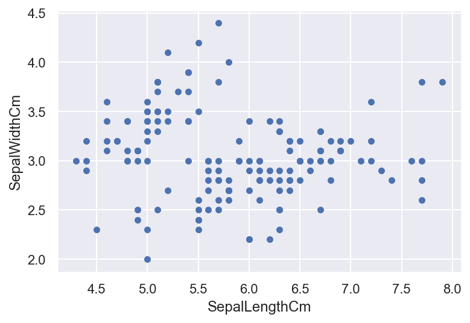
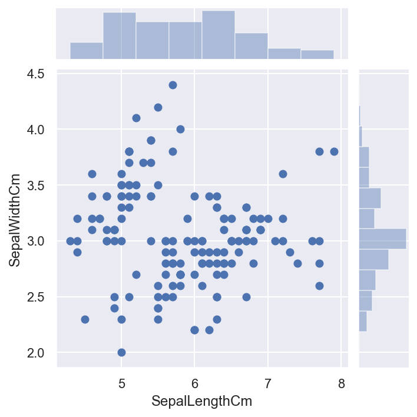
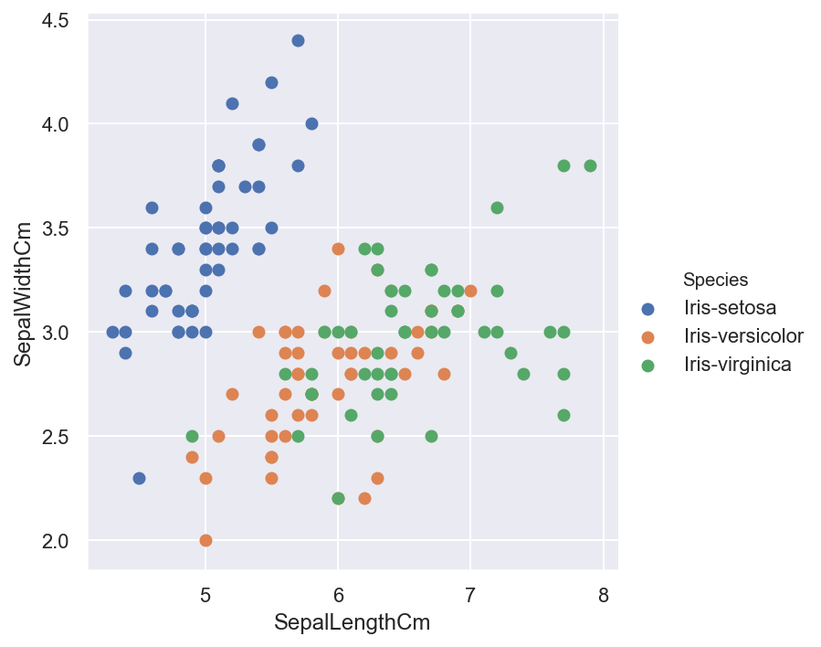
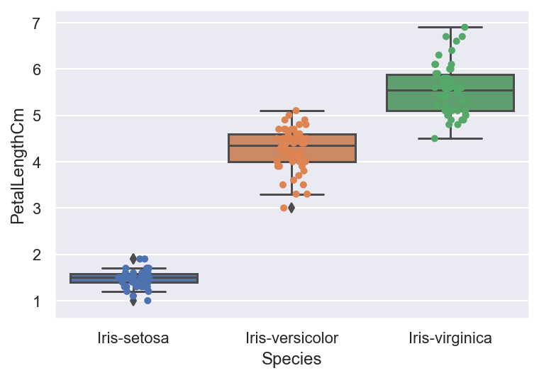
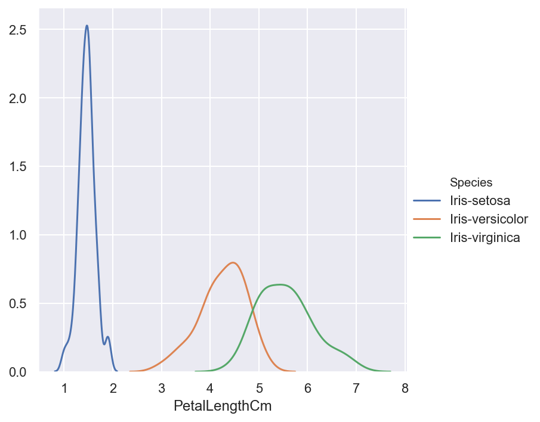
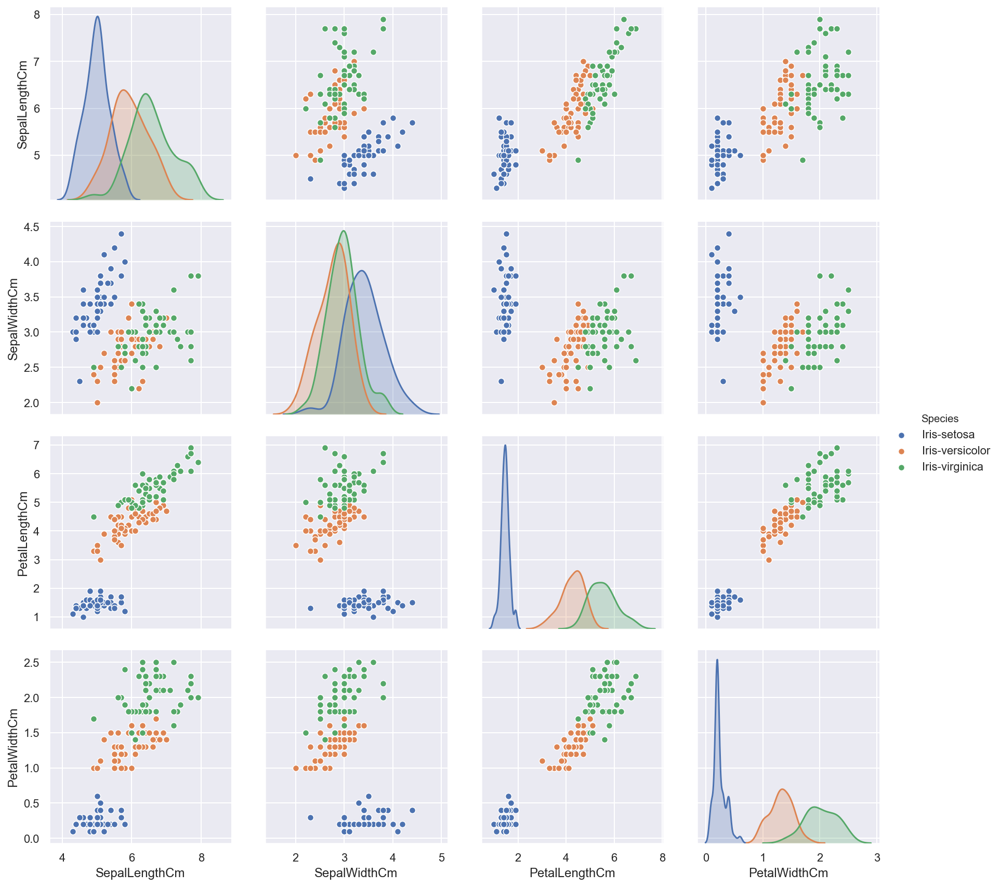
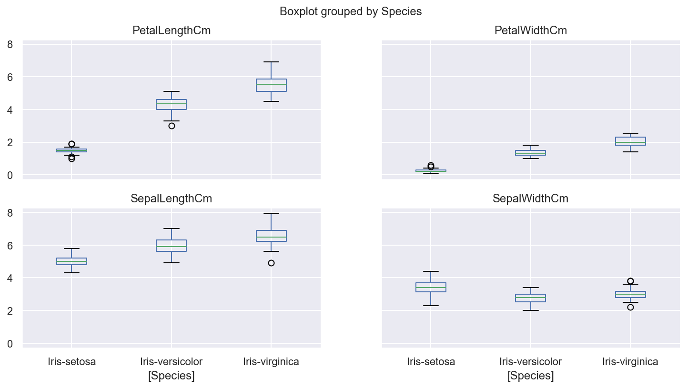
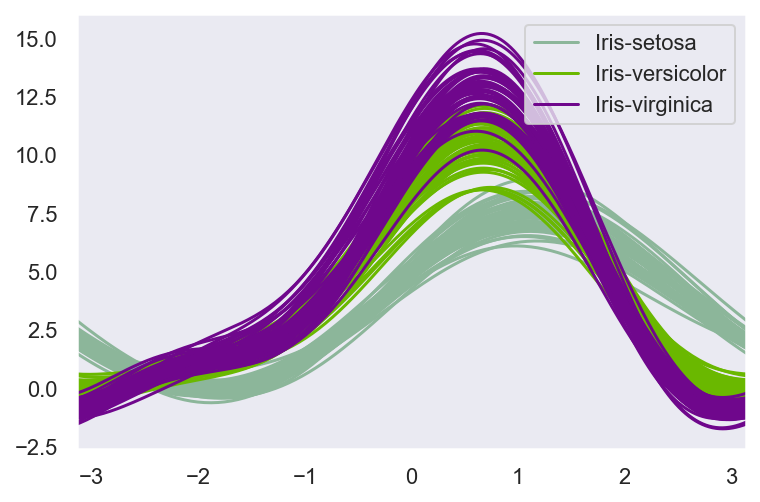
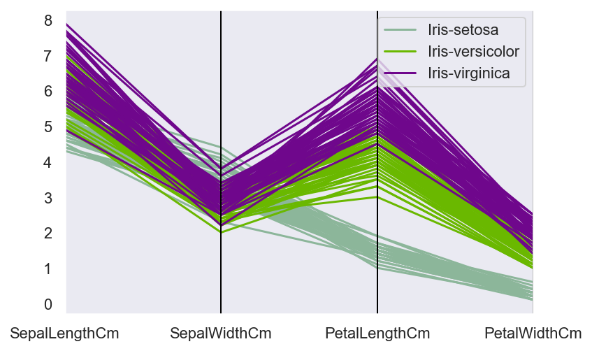
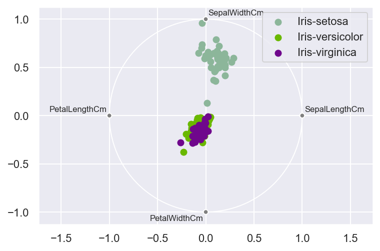

```python
import pandas as pd
import numpy as np

import seaborn as sns
sns.set(style = "darkgrid",color_codes = True)
%config InlineBackend.figure_format = 'retina'

import matplotlib.pyplot as plt
%matplotlib inline

import warnings
warnings.filterwarnings("ignore")
```


```python
iris = pd.read_csv("F:/Chrome_downloads/iris.csv")
```


```python
iris.head()
```


<div>
<style scoped>
    .dataframe tbody tr th:only-of-type {
        vertical-align: middle;
    }

    .dataframe tbody tr th {
        vertical-align: top;
    }

    .dataframe thead th {
        text-align: right;
    }
</style>
<table border="1" class="dataframe">
  <thead>
    <tr style="text-align: right;">
      <th></th>
      <th>Id</th>
      <th>SepalLengthCm</th>
      <th>SepalWidthCm</th>
      <th>PetalLengthCm</th>
      <th>PetalWidthCm</th>
      <th>Species</th>
    </tr>
  </thead>
  <tbody>
    <tr>
      <td>0</td>
      <td>1</td>
      <td>5.1</td>
      <td>3.5</td>
      <td>1.4</td>
      <td>0.2</td>
      <td>Iris-setosa</td>
    </tr>
    <tr>
      <td>1</td>
      <td>2</td>
      <td>4.9</td>
      <td>3.0</td>
      <td>1.4</td>
      <td>0.2</td>
      <td>Iris-setosa</td>
    </tr>
    <tr>
      <td>2</td>
      <td>3</td>
      <td>4.7</td>
      <td>3.2</td>
      <td>1.3</td>
      <td>0.2</td>
      <td>Iris-setosa</td>
    </tr>
    <tr>
      <td>3</td>
      <td>4</td>
      <td>4.6</td>
      <td>3.1</td>
      <td>1.5</td>
      <td>0.2</td>
      <td>Iris-setosa</td>
    </tr>
    <tr>
      <td>4</td>
      <td>5</td>
      <td>5.0</td>
      <td>3.6</td>
      <td>1.4</td>
      <td>0.2</td>
      <td>Iris-setosa</td>
    </tr>
  </tbody>
</table>
</div>


```python
iris.plot(kind = "scatter",x = "SepalLengthCm",y = "SepalWidthCm")
```

    'c' argument looks like a single numeric RGB or RGBA sequence, which should be avoided as value-mapping will have precedence in case its length matches with 'x' & 'y'.  Please use a 2-D array with a single row if you really want to specify the same RGB or RGBA value for all points.
    


    <matplotlib.axes._subplots.AxesSubplot at 0x192dc5ff588>





```python
sns.jointplot(x = "SepalLengthCm",y = "SepalWidthCm",data = iris,size =5) #size 控制图的大小
```


    <seaborn.axisgrid.JointGrid at 0x192dc658208>





```python
sns.FacetGrid(iris,hue = "Species",size = 5)\
    .map(plt.scatter,"SepalLengthCm","SepalWidthCm")\
    .add_legend()
```


    <seaborn.axisgrid.FacetGrid at 0x192dc77e348>





```python
ax = sns.boxplot(x = "Species",y = "PetalLengthCm",data = iris)
ax = sns.stripplot(x = "Species",y = "PetalLengthCm",data = iris,jitter = True , edgecolor = "gray")
#jitter为True，点不会在一条直线上，会四处散开
```





```python
sns.FacetGrid(iris,hue = "Species",size = 5)\
   .map(sns.kdeplot,"PetalLengthCm")\
   .add_legend() 
```


    <seaborn.axisgrid.FacetGrid at 0x192dcab5f88>





```python
sns.pairplot(iris.drop(["Id"],axis = 1),hue = "Species",size = 3,diag_kind = "kde")
```


    <seaborn.axisgrid.PairGrid at 0x192dcb31488>





```python
iris.drop(["Id"],axis = 1).boxplot(by = "Species",figsize =(12,6))
```


    array([[<matplotlib.axes._subplots.AxesSubplot object at 0x00000192DDFB70C8>,
            <matplotlib.axes._subplots.AxesSubplot object at 0x00000192DDF31A88>],
           [<matplotlib.axes._subplots.AxesSubplot object at 0x00000192DE023D88>,
            <matplotlib.axes._subplots.AxesSubplot object at 0x00000192DE05B488>]],
          dtype=object)





# 降多维为二维的聚类方法


```python
#一种降多维为二维的聚类方法
#andrew 曲线,两条线越接近,走势越像,表明这两个种类越像一类
from pandas.plotting import andrews_curves
andrews_curves(iris.drop(["Id"],axis = 1),"Species")
```


    <matplotlib.axes._subplots.AxesSubplot at 0x192de28c988>





```python
#parallel_coordinates
#一种降多维为二维的聚类方法
#两条线越接近,走势越像,表明这两个种类越像一类
from pandas.plotting import parallel_coordinates
parallel_coordinates(iris.drop("Id",axis = 1),"Species")
```


    <matplotlib.axes._subplots.AxesSubplot at 0x192de4fbb88>





```python
#radviz
#一种降多维为二维的聚类方法
#四个特征变成四个点，在一个单位圆边的四个位置，均分单位圆的边长
#散点代表样本，颜色代表种类，重叠在一起或者靠着很近的点表示它们的类别更近，更像是一类
from pandas.plotting import radviz
radviz(iris.drop(["Id"],axis = 1),"Species")
```


    <matplotlib.axes._subplots.AxesSubplot at 0x192dea9ca48>





```python

```
