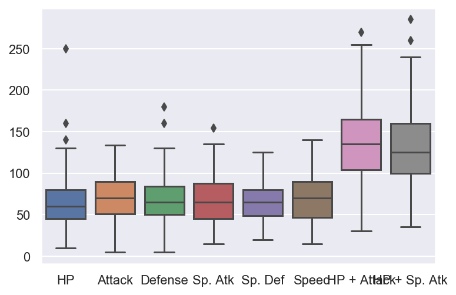

```python
import numpy as np
import pandas as pd
```


```python
import matplotlib.pyplot as plt
import seaborn as sns
%matplotlib inline
sns.set(style = "darkgrid")
%config InlineBackend.figure_format = 'retina'
```


```python
df = pd.read_csv("F:/Chrome_downloads/Pokemon.csv",index_col = 0)
```


```python
df.head()
```


<div>
<style scoped>
    .dataframe tbody tr th:only-of-type {
        vertical-align: middle;
    }

    .dataframe tbody tr th {
        vertical-align: top;
    }

    .dataframe thead th {
        text-align: right;
    }
</style>
<table border="1" class="dataframe">
  <thead>
    <tr style="text-align: right;">
      <th></th>
      <th>Name</th>
      <th>Type 1</th>
      <th>Type 2</th>
      <th>Total</th>
      <th>HP</th>
      <th>Attack</th>
      <th>Defense</th>
      <th>Sp. Atk</th>
      <th>Sp. Def</th>
      <th>Speed</th>
      <th>Stage</th>
      <th>Legendary</th>
    </tr>
    <tr>
      <th>#</th>
      <th></th>
      <th></th>
      <th></th>
      <th></th>
      <th></th>
      <th></th>
      <th></th>
      <th></th>
      <th></th>
      <th></th>
      <th></th>
      <th></th>
    </tr>
  </thead>
  <tbody>
    <tr>
      <td>1</td>
      <td>Bulbasaur</td>
      <td>Grass</td>
      <td>Poison</td>
      <td>318</td>
      <td>45</td>
      <td>49</td>
      <td>49</td>
      <td>65</td>
      <td>65</td>
      <td>45</td>
      <td>1</td>
      <td>False</td>
    </tr>
    <tr>
      <td>2</td>
      <td>Ivysaur</td>
      <td>Grass</td>
      <td>Poison</td>
      <td>405</td>
      <td>60</td>
      <td>62</td>
      <td>63</td>
      <td>80</td>
      <td>80</td>
      <td>60</td>
      <td>2</td>
      <td>False</td>
    </tr>
    <tr>
      <td>3</td>
      <td>Venusaur</td>
      <td>Grass</td>
      <td>Poison</td>
      <td>525</td>
      <td>80</td>
      <td>82</td>
      <td>83</td>
      <td>100</td>
      <td>100</td>
      <td>80</td>
      <td>3</td>
      <td>False</td>
    </tr>
    <tr>
      <td>4</td>
      <td>Charmander</td>
      <td>Fire</td>
      <td>NaN</td>
      <td>309</td>
      <td>39</td>
      <td>52</td>
      <td>43</td>
      <td>60</td>
      <td>50</td>
      <td>65</td>
      <td>1</td>
      <td>False</td>
    </tr>
    <tr>
      <td>5</td>
      <td>Charmeleon</td>
      <td>Fire</td>
      <td>NaN</td>
      <td>405</td>
      <td>58</td>
      <td>64</td>
      <td>58</td>
      <td>80</td>
      <td>65</td>
      <td>80</td>
      <td>2</td>
      <td>False</td>
    </tr>
  </tbody>
</table>
</div>


```python
df["HP + Attack"] = df["HP"] + df["Attack"]
df["HP + Sp. Atk"]= df["HP"] + df["Sp. Atk"]
```


```python
df.sort_values(by = "HP + Attack",ascending = False).head(15)
```


<div>
<style scoped>
    .dataframe tbody tr th:only-of-type {
        vertical-align: middle;
    }

    .dataframe tbody tr th {
        vertical-align: top;
    }

    .dataframe thead th {
        text-align: right;
    }
</style>
<table border="1" class="dataframe">
  <thead>
    <tr style="text-align: right;">
      <th></th>
      <th>Name</th>
      <th>Type 1</th>
      <th>Type 2</th>
      <th>Total</th>
      <th>HP</th>
      <th>Attack</th>
      <th>Defense</th>
      <th>Sp. Atk</th>
      <th>Sp. Def</th>
      <th>Speed</th>
      <th>Stage</th>
      <th>Legendary</th>
      <th>HP + Attack</th>
      <th>HP + Sp. Atk</th>
    </tr>
    <tr>
      <th>#</th>
      <th></th>
      <th></th>
      <th></th>
      <th></th>
      <th></th>
      <th></th>
      <th></th>
      <th></th>
      <th></th>
      <th></th>
      <th></th>
      <th></th>
      <th></th>
      <th></th>
    </tr>
  </thead>
  <tbody>
    <tr>
      <td>143</td>
      <td>Snorlax</td>
      <td>Normal</td>
      <td>NaN</td>
      <td>540</td>
      <td>160</td>
      <td>110</td>
      <td>65</td>
      <td>65</td>
      <td>110</td>
      <td>30</td>
      <td>1</td>
      <td>False</td>
      <td>270</td>
      <td>225</td>
    </tr>
    <tr>
      <td>113</td>
      <td>Chansey</td>
      <td>Normal</td>
      <td>NaN</td>
      <td>450</td>
      <td>250</td>
      <td>5</td>
      <td>5</td>
      <td>35</td>
      <td>105</td>
      <td>50</td>
      <td>1</td>
      <td>False</td>
      <td>255</td>
      <td>285</td>
    </tr>
    <tr>
      <td>112</td>
      <td>Rhydon</td>
      <td>Ground</td>
      <td>Rock</td>
      <td>485</td>
      <td>105</td>
      <td>130</td>
      <td>120</td>
      <td>45</td>
      <td>45</td>
      <td>40</td>
      <td>2</td>
      <td>False</td>
      <td>235</td>
      <td>150</td>
    </tr>
    <tr>
      <td>149</td>
      <td>Dragonite</td>
      <td>Dragon</td>
      <td>Flying</td>
      <td>600</td>
      <td>91</td>
      <td>134</td>
      <td>95</td>
      <td>100</td>
      <td>100</td>
      <td>80</td>
      <td>3</td>
      <td>False</td>
      <td>225</td>
      <td>191</td>
    </tr>
    <tr>
      <td>130</td>
      <td>Gyarados</td>
      <td>Water</td>
      <td>Flying</td>
      <td>540</td>
      <td>95</td>
      <td>125</td>
      <td>79</td>
      <td>60</td>
      <td>100</td>
      <td>81</td>
      <td>2</td>
      <td>False</td>
      <td>220</td>
      <td>155</td>
    </tr>
    <tr>
      <td>68</td>
      <td>Machamp</td>
      <td>Fighting</td>
      <td>NaN</td>
      <td>505</td>
      <td>90</td>
      <td>130</td>
      <td>80</td>
      <td>65</td>
      <td>85</td>
      <td>55</td>
      <td>3</td>
      <td>False</td>
      <td>220</td>
      <td>155</td>
    </tr>
    <tr>
      <td>150</td>
      <td>Mewtwo</td>
      <td>Psychic</td>
      <td>NaN</td>
      <td>680</td>
      <td>106</td>
      <td>110</td>
      <td>90</td>
      <td>154</td>
      <td>90</td>
      <td>130</td>
      <td>1</td>
      <td>True</td>
      <td>216</td>
      <td>260</td>
    </tr>
    <tr>
      <td>131</td>
      <td>Lapras</td>
      <td>Water</td>
      <td>Ice</td>
      <td>535</td>
      <td>130</td>
      <td>85</td>
      <td>80</td>
      <td>85</td>
      <td>95</td>
      <td>60</td>
      <td>1</td>
      <td>False</td>
      <td>215</td>
      <td>215</td>
    </tr>
    <tr>
      <td>40</td>
      <td>Wigglytuff</td>
      <td>Normal</td>
      <td>Fairy</td>
      <td>435</td>
      <td>140</td>
      <td>70</td>
      <td>45</td>
      <td>85</td>
      <td>50</td>
      <td>45</td>
      <td>2</td>
      <td>False</td>
      <td>210</td>
      <td>225</td>
    </tr>
    <tr>
      <td>89</td>
      <td>Muk</td>
      <td>Poison</td>
      <td>NaN</td>
      <td>500</td>
      <td>105</td>
      <td>105</td>
      <td>75</td>
      <td>65</td>
      <td>100</td>
      <td>50</td>
      <td>2</td>
      <td>False</td>
      <td>210</td>
      <td>170</td>
    </tr>
    <tr>
      <td>76</td>
      <td>Golem</td>
      <td>Rock</td>
      <td>Ground</td>
      <td>495</td>
      <td>80</td>
      <td>120</td>
      <td>130</td>
      <td>55</td>
      <td>65</td>
      <td>45</td>
      <td>3</td>
      <td>False</td>
      <td>200</td>
      <td>135</td>
    </tr>
    <tr>
      <td>115</td>
      <td>Kangaskhan</td>
      <td>Normal</td>
      <td>NaN</td>
      <td>490</td>
      <td>105</td>
      <td>95</td>
      <td>80</td>
      <td>40</td>
      <td>80</td>
      <td>90</td>
      <td>1</td>
      <td>False</td>
      <td>200</td>
      <td>145</td>
    </tr>
    <tr>
      <td>59</td>
      <td>Arcanine</td>
      <td>Fire</td>
      <td>NaN</td>
      <td>555</td>
      <td>90</td>
      <td>110</td>
      <td>80</td>
      <td>100</td>
      <td>80</td>
      <td>95</td>
      <td>2</td>
      <td>False</td>
      <td>200</td>
      <td>190</td>
    </tr>
    <tr>
      <td>151</td>
      <td>Mew</td>
      <td>Psychic</td>
      <td>NaN</td>
      <td>600</td>
      <td>100</td>
      <td>100</td>
      <td>100</td>
      <td>100</td>
      <td>100</td>
      <td>100</td>
      <td>1</td>
      <td>False</td>
      <td>200</td>
      <td>200</td>
    </tr>
    <tr>
      <td>134</td>
      <td>Vaporeon</td>
      <td>Water</td>
      <td>NaN</td>
      <td>525</td>
      <td>130</td>
      <td>65</td>
      <td>60</td>
      <td>110</td>
      <td>95</td>
      <td>65</td>
      <td>2</td>
      <td>False</td>
      <td>195</td>
      <td>240</td>
    </tr>
  </tbody>
</table>
</div>


```python
df.sort_values(by = "HP + Sp. Atk",ascending = False).head(15)
```


<div>
<style scoped>
    .dataframe tbody tr th:only-of-type {
        vertical-align: middle;
    }

    .dataframe tbody tr th {
        vertical-align: top;
    }

    .dataframe thead th {
        text-align: right;
    }
</style>
<table border="1" class="dataframe">
  <thead>
    <tr style="text-align: right;">
      <th></th>
      <th>Name</th>
      <th>Type 1</th>
      <th>Type 2</th>
      <th>Total</th>
      <th>HP</th>
      <th>Attack</th>
      <th>Defense</th>
      <th>Sp. Atk</th>
      <th>Sp. Def</th>
      <th>Speed</th>
      <th>Stage</th>
      <th>Legendary</th>
      <th>HP + Attack</th>
      <th>HP + Sp. Atk</th>
    </tr>
    <tr>
      <th>#</th>
      <th></th>
      <th></th>
      <th></th>
      <th></th>
      <th></th>
      <th></th>
      <th></th>
      <th></th>
      <th></th>
      <th></th>
      <th></th>
      <th></th>
      <th></th>
      <th></th>
    </tr>
  </thead>
  <tbody>
    <tr>
      <td>113</td>
      <td>Chansey</td>
      <td>Normal</td>
      <td>NaN</td>
      <td>450</td>
      <td>250</td>
      <td>5</td>
      <td>5</td>
      <td>35</td>
      <td>105</td>
      <td>50</td>
      <td>1</td>
      <td>False</td>
      <td>255</td>
      <td>285</td>
    </tr>
    <tr>
      <td>150</td>
      <td>Mewtwo</td>
      <td>Psychic</td>
      <td>NaN</td>
      <td>680</td>
      <td>106</td>
      <td>110</td>
      <td>90</td>
      <td>154</td>
      <td>90</td>
      <td>130</td>
      <td>1</td>
      <td>True</td>
      <td>216</td>
      <td>260</td>
    </tr>
    <tr>
      <td>134</td>
      <td>Vaporeon</td>
      <td>Water</td>
      <td>NaN</td>
      <td>525</td>
      <td>130</td>
      <td>65</td>
      <td>60</td>
      <td>110</td>
      <td>95</td>
      <td>65</td>
      <td>2</td>
      <td>False</td>
      <td>195</td>
      <td>240</td>
    </tr>
    <tr>
      <td>143</td>
      <td>Snorlax</td>
      <td>Normal</td>
      <td>NaN</td>
      <td>540</td>
      <td>160</td>
      <td>110</td>
      <td>65</td>
      <td>65</td>
      <td>110</td>
      <td>30</td>
      <td>1</td>
      <td>False</td>
      <td>270</td>
      <td>225</td>
    </tr>
    <tr>
      <td>40</td>
      <td>Wigglytuff</td>
      <td>Normal</td>
      <td>Fairy</td>
      <td>435</td>
      <td>140</td>
      <td>70</td>
      <td>45</td>
      <td>85</td>
      <td>50</td>
      <td>45</td>
      <td>2</td>
      <td>False</td>
      <td>210</td>
      <td>225</td>
    </tr>
    <tr>
      <td>103</td>
      <td>Exeggutor</td>
      <td>Grass</td>
      <td>Psychic</td>
      <td>520</td>
      <td>95</td>
      <td>95</td>
      <td>85</td>
      <td>125</td>
      <td>65</td>
      <td>55</td>
      <td>2</td>
      <td>False</td>
      <td>190</td>
      <td>220</td>
    </tr>
    <tr>
      <td>131</td>
      <td>Lapras</td>
      <td>Water</td>
      <td>Ice</td>
      <td>535</td>
      <td>130</td>
      <td>85</td>
      <td>80</td>
      <td>85</td>
      <td>95</td>
      <td>60</td>
      <td>1</td>
      <td>False</td>
      <td>215</td>
      <td>215</td>
    </tr>
    <tr>
      <td>146</td>
      <td>Moltres</td>
      <td>Fire</td>
      <td>Flying</td>
      <td>580</td>
      <td>90</td>
      <td>100</td>
      <td>90</td>
      <td>125</td>
      <td>85</td>
      <td>90</td>
      <td>1</td>
      <td>True</td>
      <td>190</td>
      <td>215</td>
    </tr>
    <tr>
      <td>145</td>
      <td>Zapdos</td>
      <td>Electric</td>
      <td>Flying</td>
      <td>580</td>
      <td>90</td>
      <td>90</td>
      <td>85</td>
      <td>125</td>
      <td>90</td>
      <td>100</td>
      <td>1</td>
      <td>True</td>
      <td>180</td>
      <td>215</td>
    </tr>
    <tr>
      <td>151</td>
      <td>Mew</td>
      <td>Psychic</td>
      <td>NaN</td>
      <td>600</td>
      <td>100</td>
      <td>100</td>
      <td>100</td>
      <td>100</td>
      <td>100</td>
      <td>100</td>
      <td>1</td>
      <td>False</td>
      <td>200</td>
      <td>200</td>
    </tr>
    <tr>
      <td>80</td>
      <td>Slowbro</td>
      <td>Water</td>
      <td>Psychic</td>
      <td>490</td>
      <td>95</td>
      <td>75</td>
      <td>110</td>
      <td>100</td>
      <td>80</td>
      <td>30</td>
      <td>2</td>
      <td>False</td>
      <td>170</td>
      <td>195</td>
    </tr>
    <tr>
      <td>149</td>
      <td>Dragonite</td>
      <td>Dragon</td>
      <td>Flying</td>
      <td>600</td>
      <td>91</td>
      <td>134</td>
      <td>95</td>
      <td>100</td>
      <td>100</td>
      <td>80</td>
      <td>3</td>
      <td>False</td>
      <td>225</td>
      <td>191</td>
    </tr>
    <tr>
      <td>59</td>
      <td>Arcanine</td>
      <td>Fire</td>
      <td>NaN</td>
      <td>555</td>
      <td>90</td>
      <td>110</td>
      <td>80</td>
      <td>100</td>
      <td>80</td>
      <td>95</td>
      <td>2</td>
      <td>False</td>
      <td>200</td>
      <td>190</td>
    </tr>
    <tr>
      <td>94</td>
      <td>Gengar</td>
      <td>Ghost</td>
      <td>Poison</td>
      <td>500</td>
      <td>60</td>
      <td>65</td>
      <td>60</td>
      <td>130</td>
      <td>75</td>
      <td>110</td>
      <td>3</td>
      <td>False</td>
      <td>125</td>
      <td>190</td>
    </tr>
    <tr>
      <td>65</td>
      <td>Alakazam</td>
      <td>Psychic</td>
      <td>NaN</td>
      <td>500</td>
      <td>55</td>
      <td>50</td>
      <td>45</td>
      <td>135</td>
      <td>95</td>
      <td>120</td>
      <td>3</td>
      <td>False</td>
      <td>105</td>
      <td>190</td>
    </tr>
  </tbody>
</table>
</div>


```python
sns.lmplot(x = "Attack",y = "Defense",data = df)
```


    <seaborn.axisgrid.FacetGrid at 0x2011451dd48>


```python
sns.lmplot(x = "Attack" , y = "Defense",data = df,fit_reg = False,hue = "Stage")
```


    <seaborn.axisgrid.FacetGrid at 0x2011451b4c8>


```python
sns.lmplot(x = "Sp. Atk",y = "Sp. Def",data = df, fit_reg = False,hue = "Stage")

plt.xlim(-10,None)
plt.ylim(0,None)
```


    (0, 130.25021964056597)


```python
new_df = df.drop(["Name","Type 1","Type 2","Total","Stage","Legendary"],axis = 1)

sns.boxplot(data = new_df)
```


    <matplotlib.axes._subplots.AxesSubplot at 0x201158c8c88>





```python
pkmn_type_colors = ['#78C850',  # Grass
                    '#F08030',  # Fire
                    '#6890F0',  # Water
                    '#A8B820',  # Bug
                    '#A8A878',  # Normal
                    '#A040A0',  # Poison
                    '#F8D030',  # Electric
                    '#E0C068',  # Ground
                    '#EE99AC',  # Fairy
                    '#C03028',  # Fighting
                    '#F85888',  # Psychic
                    '#B8A038',  # Rock
                    '#705898',  # Ghost
                    '#98D8D8',  # Ice
                    '#7038F8',  # Dragon
                   ]
```


```python
plt.figure(figsize = (13,7))
sns.set_style("whitegrid")
sns.violinplot(x = "Type 1",y = "Attack",data = df,palette = pkmn_type_colors )
```


    <matplotlib.axes._subplots.AxesSubplot at 0x20115993188>


```python
plt.figure(figsize = (13,7))
sns.swarmplot(x = "Type 1",y = "Attack",data = df ,palette = pkmn_type_colors)
```


    <matplotlib.axes._subplots.AxesSubplot at 0x20115a86f88>


```python
plt.figure(figsize = (13,7))
sns.violinplot(x = "Type 1",
               y = "Attack",
               data = df,
               palette = pkmn_type_colors,
               inner = None)

sns.swarmplot(x = "Type 1",
              y = "Attack",
              data = df,
              color = "k",
              alpha = 0.7)

plt.title("Attack by type")
```


    Text(0.5, 1.0, 'Attack by type')


```python
stat_df = df.drop(["Total","Legendary","Stage"],axis = 1)
melted_df = pd.melt(stat_df,
                   id_vars = ["Name","Type 1","Type 2"],#保留的自变量
                   var_name = "Stat") #新生成的自变量
melted_df.head()
```


<div>
<style scoped>
    .dataframe tbody tr th:only-of-type {
        vertical-align: middle;
    }

    .dataframe tbody tr th {
        vertical-align: top;
    }

    .dataframe thead th {
        text-align: right;
    }
</style>
<table border="1" class="dataframe">
  <thead>
    <tr style="text-align: right;">
      <th></th>
      <th>Name</th>
      <th>Type 1</th>
      <th>Type 2</th>
      <th>Stat</th>
      <th>value</th>
    </tr>
  </thead>
  <tbody>
    <tr>
      <td>0</td>
      <td>Bulbasaur</td>
      <td>Grass</td>
      <td>Poison</td>
      <td>HP</td>
      <td>45</td>
    </tr>
    <tr>
      <td>1</td>
      <td>Ivysaur</td>
      <td>Grass</td>
      <td>Poison</td>
      <td>HP</td>
      <td>60</td>
    </tr>
    <tr>
      <td>2</td>
      <td>Venusaur</td>
      <td>Grass</td>
      <td>Poison</td>
      <td>HP</td>
      <td>80</td>
    </tr>
    <tr>
      <td>3</td>
      <td>Charmander</td>
      <td>Fire</td>
      <td>NaN</td>
      <td>HP</td>
      <td>39</td>
    </tr>
    <tr>
      <td>4</td>
      <td>Charmeleon</td>
      <td>Fire</td>
      <td>NaN</td>
      <td>HP</td>
      <td>58</td>
    </tr>
  </tbody>
</table>
</div>


```python
plt.figure(figsize = (13,7))

sns.swarmplot(x = "Stat",
              y = "value",
              data = melted_df,
              hue = "Type 1",
              split = True, #True的时候才会让y数值接近但是Type 1不同的散点分开，False的话会靠近在一起
              palette = pkmn_type_colors,
             )

plt.ylim(0,260)
plt.legend(bbox_to_anchor = (1,1),loc = 2)
```

    E:\Anaconda\lib\site-packages\seaborn\categorical.py:2974: UserWarning: The `split` parameter has been renamed to `dodge`.
      warnings.warn(msg, UserWarning)
    


    <matplotlib.legend.Legend at 0x20116529e88>


```python
plt.figure(figsize = (13,7))

sns.swarmplot(x = "Stat",
              y = "value",
              data = melted_df,
              hue = "Type 1",
              split = False, #True的时候才会让y数值接近但是Type 1不同的散点分开，False的话会靠近在一起
              palette = pkmn_type_colors,
             )

plt.ylim(0,260)
plt.legend(bbox_to_anchor = (1,1),loc = 2)
```


    <matplotlib.legend.Legend at 0x201162269c8>


```python
plt.figure(figsize = (13,7))
stat_corr = stat_df.drop(["Name","Type 1","Type 2"],axis = 1).corr()

sns.heatmap(stat_corr)
```


    <matplotlib.axes._subplots.AxesSubplot at 0x201162f45c8>


```python
plt.figure(figsize = (13,7))
sns.distplot(df.Defense)
```


    <matplotlib.axes._subplots.AxesSubplot at 0x20116da36c8>


```python
plt.figure(figsize = (13,7))
g = sns.countplot(x = "Type 1",data = df,palette = pkmn_type_colors)

plt.xticks(rotation =-45)
```


    (array([ 0,  1,  2,  3,  4,  5,  6,  7,  8,  9, 10, 11, 12, 13, 14]),
     <a list of 15 Text xticklabel objects>)


```python
g = sns.factorplot(x = "Type 1",
                   y ="Sp. Atk",
                   data = df,
                   hue = "Stage",
                   col = "Stage",
                   kind = "swarm")

g.set_xticklabels(rotation = -45)
```

    E:\Anaconda\lib\site-packages\seaborn\categorical.py:3666: UserWarning: The `factorplot` function has been renamed to `catplot`. The original name will be removed in a future release. Please update your code. Note that the default `kind` in `factorplot` (`'point'`) has changed `'strip'` in `catplot`.
      warnings.warn(msg)
    


    <seaborn.axisgrid.FacetGrid at 0x20116cb3f08>


```python
df.columns
```


    Index(['Name', 'Type 1', 'Type 2', 'Total', 'HP', 'Attack', 'Defense',
           'Sp. Atk', 'Sp. Def', 'Speed', 'Stage', 'Legendary', 'HP + Attack',
           'HP + Sp. Atk'],
          dtype='object')


```python
sns.kdeplot(df.Attack,df.Speed)
```


    <matplotlib.axes._subplots.AxesSubplot at 0x201190b3d88>


```python
sns.jointplot(x = "Attack",y = "Defense",data = df)
```


    <seaborn.axisgrid.JointGrid at 0x20119310d48>


# 研究哪些pokemon更像神兽


```python
df["Legendary"] = [int(x) for x in df.Legendary]
```


```python
df.head()
```


<div>
<style scoped>
    .dataframe tbody tr th:only-of-type {
        vertical-align: middle;
    }

    .dataframe tbody tr th {
        vertical-align: top;
    }

    .dataframe thead th {
        text-align: right;
    }
</style>
<table border="1" class="dataframe">
  <thead>
    <tr style="text-align: right;">
      <th></th>
      <th>Name</th>
      <th>Type 1</th>
      <th>Type 2</th>
      <th>Total</th>
      <th>HP</th>
      <th>Attack</th>
      <th>Defense</th>
      <th>Sp. Atk</th>
      <th>Sp. Def</th>
      <th>Speed</th>
      <th>Stage</th>
      <th>Legendary</th>
      <th>HP + Attack</th>
      <th>HP + Sp. Atk</th>
    </tr>
    <tr>
      <th>#</th>
      <th></th>
      <th></th>
      <th></th>
      <th></th>
      <th></th>
      <th></th>
      <th></th>
      <th></th>
      <th></th>
      <th></th>
      <th></th>
      <th></th>
      <th></th>
      <th></th>
    </tr>
  </thead>
  <tbody>
    <tr>
      <td>1</td>
      <td>Bulbasaur</td>
      <td>Grass</td>
      <td>Poison</td>
      <td>318</td>
      <td>45</td>
      <td>49</td>
      <td>49</td>
      <td>65</td>
      <td>65</td>
      <td>45</td>
      <td>1</td>
      <td>0</td>
      <td>94</td>
      <td>110</td>
    </tr>
    <tr>
      <td>2</td>
      <td>Ivysaur</td>
      <td>Grass</td>
      <td>Poison</td>
      <td>405</td>
      <td>60</td>
      <td>62</td>
      <td>63</td>
      <td>80</td>
      <td>80</td>
      <td>60</td>
      <td>2</td>
      <td>0</td>
      <td>122</td>
      <td>140</td>
    </tr>
    <tr>
      <td>3</td>
      <td>Venusaur</td>
      <td>Grass</td>
      <td>Poison</td>
      <td>525</td>
      <td>80</td>
      <td>82</td>
      <td>83</td>
      <td>100</td>
      <td>100</td>
      <td>80</td>
      <td>3</td>
      <td>0</td>
      <td>162</td>
      <td>180</td>
    </tr>
    <tr>
      <td>4</td>
      <td>Charmander</td>
      <td>Fire</td>
      <td>NaN</td>
      <td>309</td>
      <td>39</td>
      <td>52</td>
      <td>43</td>
      <td>60</td>
      <td>50</td>
      <td>65</td>
      <td>1</td>
      <td>0</td>
      <td>91</td>
      <td>99</td>
    </tr>
    <tr>
      <td>5</td>
      <td>Charmeleon</td>
      <td>Fire</td>
      <td>NaN</td>
      <td>405</td>
      <td>58</td>
      <td>64</td>
      <td>58</td>
      <td>80</td>
      <td>65</td>
      <td>80</td>
      <td>2</td>
      <td>0</td>
      <td>122</td>
      <td>138</td>
    </tr>
  </tbody>
</table>
</div>


```python
from sklearn.linear_model import LogisticRegression 
from sklearn.model_selection import cross_val_predict
```


```python
x = df[["Total","HP","Attack","Defense","Sp. Atk","Sp. Def","Speed"]].copy()
y = df.Legendary.copy()
```


```python
lo_model = LogisticRegression(random_state = 42)
lo_model.fit(x,y)
```

    E:\Anaconda\lib\site-packages\sklearn\linear_model\logistic.py:432: FutureWarning: Default solver will be changed to 'lbfgs' in 0.22. Specify a solver to silence this warning.
      FutureWarning)
    


    LogisticRegression(C=1.0, class_weight=None, dual=False, fit_intercept=True,
                       intercept_scaling=1, l1_ratio=None, max_iter=100,
                       multi_class='warn', n_jobs=None, penalty='l2',
                       random_state=42, solver='warn', tol=0.0001, verbose=0,
                       warm_start=False)


```python
lo_model.coef_ #系数的绝对值越大，一般该特征越重要
```


    array([[-2.98350749e-03, -9.46305780e-04,  4.63279850e-05,
            -1.58523152e-02,  3.68737844e-02, -5.86546404e-03,
            -1.72395349e-02]])


看来攻击，特攻，速度，是三大重要因素，防御力是最不重要的


```python
sum(lo_model.predict_proba(x)[:,1:]>0.1)
```


    array([14])


```python
df[lo_model.predict_proba(x)[:,1:]>0.1]
```


<div>
<style scoped>
    .dataframe tbody tr th:only-of-type {
        vertical-align: middle;
    }

    .dataframe tbody tr th {
        vertical-align: top;
    }

    .dataframe thead th {
        text-align: right;
    }
</style>
<table border="1" class="dataframe">
  <thead>
    <tr style="text-align: right;">
      <th></th>
      <th>Name</th>
      <th>Type 1</th>
      <th>Type 2</th>
      <th>Total</th>
      <th>HP</th>
      <th>Attack</th>
      <th>Defense</th>
      <th>Sp. Atk</th>
      <th>Sp. Def</th>
      <th>Speed</th>
      <th>Stage</th>
      <th>Legendary</th>
      <th>HP + Attack</th>
      <th>HP + Sp. Atk</th>
    </tr>
    <tr>
      <th>#</th>
      <th></th>
      <th></th>
      <th></th>
      <th></th>
      <th></th>
      <th></th>
      <th></th>
      <th></th>
      <th></th>
      <th></th>
      <th></th>
      <th></th>
      <th></th>
      <th></th>
    </tr>
  </thead>
  <tbody>
    <tr>
      <td>39</td>
      <td>Jigglypuff</td>
      <td>Normal</td>
      <td>Fairy</td>
      <td>270</td>
      <td>115</td>
      <td>45</td>
      <td>20</td>
      <td>45</td>
      <td>25</td>
      <td>20</td>
      <td>1</td>
      <td>0</td>
      <td>160</td>
      <td>160</td>
    </tr>
    <tr>
      <td>40</td>
      <td>Wigglytuff</td>
      <td>Normal</td>
      <td>Fairy</td>
      <td>435</td>
      <td>140</td>
      <td>70</td>
      <td>45</td>
      <td>85</td>
      <td>50</td>
      <td>45</td>
      <td>2</td>
      <td>0</td>
      <td>210</td>
      <td>225</td>
    </tr>
    <tr>
      <td>43</td>
      <td>Oddish</td>
      <td>Grass</td>
      <td>Poison</td>
      <td>320</td>
      <td>45</td>
      <td>50</td>
      <td>55</td>
      <td>75</td>
      <td>65</td>
      <td>30</td>
      <td>1</td>
      <td>0</td>
      <td>95</td>
      <td>120</td>
    </tr>
    <tr>
      <td>63</td>
      <td>Abra</td>
      <td>Psychic</td>
      <td>NaN</td>
      <td>310</td>
      <td>25</td>
      <td>20</td>
      <td>15</td>
      <td>105</td>
      <td>55</td>
      <td>90</td>
      <td>1</td>
      <td>0</td>
      <td>45</td>
      <td>130</td>
    </tr>
    <tr>
      <td>64</td>
      <td>Kadabra</td>
      <td>Psychic</td>
      <td>NaN</td>
      <td>400</td>
      <td>40</td>
      <td>35</td>
      <td>30</td>
      <td>120</td>
      <td>70</td>
      <td>105</td>
      <td>2</td>
      <td>0</td>
      <td>75</td>
      <td>160</td>
    </tr>
    <tr>
      <td>65</td>
      <td>Alakazam</td>
      <td>Psychic</td>
      <td>NaN</td>
      <td>500</td>
      <td>55</td>
      <td>50</td>
      <td>45</td>
      <td>135</td>
      <td>95</td>
      <td>120</td>
      <td>3</td>
      <td>0</td>
      <td>105</td>
      <td>190</td>
    </tr>
    <tr>
      <td>69</td>
      <td>Bellsprout</td>
      <td>Grass</td>
      <td>Poison</td>
      <td>300</td>
      <td>50</td>
      <td>75</td>
      <td>35</td>
      <td>70</td>
      <td>30</td>
      <td>40</td>
      <td>1</td>
      <td>0</td>
      <td>125</td>
      <td>120</td>
    </tr>
    <tr>
      <td>70</td>
      <td>Weepinbell</td>
      <td>Grass</td>
      <td>Poison</td>
      <td>390</td>
      <td>65</td>
      <td>90</td>
      <td>50</td>
      <td>85</td>
      <td>45</td>
      <td>55</td>
      <td>2</td>
      <td>0</td>
      <td>155</td>
      <td>150</td>
    </tr>
    <tr>
      <td>81</td>
      <td>Magnemite</td>
      <td>Electric</td>
      <td>Steel</td>
      <td>325</td>
      <td>25</td>
      <td>35</td>
      <td>70</td>
      <td>95</td>
      <td>55</td>
      <td>45</td>
      <td>1</td>
      <td>0</td>
      <td>60</td>
      <td>120</td>
    </tr>
    <tr>
      <td>92</td>
      <td>Gastly</td>
      <td>Ghost</td>
      <td>Poison</td>
      <td>310</td>
      <td>30</td>
      <td>35</td>
      <td>30</td>
      <td>100</td>
      <td>35</td>
      <td>80</td>
      <td>1</td>
      <td>0</td>
      <td>65</td>
      <td>130</td>
    </tr>
    <tr>
      <td>93</td>
      <td>Haunter</td>
      <td>Ghost</td>
      <td>Poison</td>
      <td>405</td>
      <td>45</td>
      <td>50</td>
      <td>45</td>
      <td>115</td>
      <td>55</td>
      <td>95</td>
      <td>2</td>
      <td>0</td>
      <td>95</td>
      <td>160</td>
    </tr>
    <tr>
      <td>94</td>
      <td>Gengar</td>
      <td>Ghost</td>
      <td>Poison</td>
      <td>500</td>
      <td>60</td>
      <td>65</td>
      <td>60</td>
      <td>130</td>
      <td>75</td>
      <td>110</td>
      <td>3</td>
      <td>0</td>
      <td>125</td>
      <td>190</td>
    </tr>
    <tr>
      <td>103</td>
      <td>Exeggutor</td>
      <td>Grass</td>
      <td>Psychic</td>
      <td>520</td>
      <td>95</td>
      <td>95</td>
      <td>85</td>
      <td>125</td>
      <td>65</td>
      <td>55</td>
      <td>2</td>
      <td>0</td>
      <td>190</td>
      <td>220</td>
    </tr>
    <tr>
      <td>124</td>
      <td>Jynx</td>
      <td>Ice</td>
      <td>Psychic</td>
      <td>455</td>
      <td>65</td>
      <td>50</td>
      <td>35</td>
      <td>115</td>
      <td>95</td>
      <td>95</td>
      <td>1</td>
      <td>0</td>
      <td>115</td>
      <td>180</td>
    </tr>
  </tbody>
</table>
</div>


```python
df[df.Legendary == 1] #真正的神兽
```


<div>
<style scoped>
    .dataframe tbody tr th:only-of-type {
        vertical-align: middle;
    }

    .dataframe tbody tr th {
        vertical-align: top;
    }

    .dataframe thead th {
        text-align: right;
    }
</style>
<table border="1" class="dataframe">
  <thead>
    <tr style="text-align: right;">
      <th></th>
      <th>Name</th>
      <th>Type 1</th>
      <th>Type 2</th>
      <th>Total</th>
      <th>HP</th>
      <th>Attack</th>
      <th>Defense</th>
      <th>Sp. Atk</th>
      <th>Sp. Def</th>
      <th>Speed</th>
      <th>Stage</th>
      <th>Legendary</th>
      <th>HP + Attack</th>
      <th>HP + Sp. Atk</th>
    </tr>
    <tr>
      <th>#</th>
      <th></th>
      <th></th>
      <th></th>
      <th></th>
      <th></th>
      <th></th>
      <th></th>
      <th></th>
      <th></th>
      <th></th>
      <th></th>
      <th></th>
      <th></th>
      <th></th>
    </tr>
  </thead>
  <tbody>
    <tr>
      <td>144</td>
      <td>Articuno</td>
      <td>Ice</td>
      <td>Flying</td>
      <td>580</td>
      <td>90</td>
      <td>85</td>
      <td>100</td>
      <td>95</td>
      <td>125</td>
      <td>85</td>
      <td>1</td>
      <td>1</td>
      <td>175</td>
      <td>185</td>
    </tr>
    <tr>
      <td>145</td>
      <td>Zapdos</td>
      <td>Electric</td>
      <td>Flying</td>
      <td>580</td>
      <td>90</td>
      <td>90</td>
      <td>85</td>
      <td>125</td>
      <td>90</td>
      <td>100</td>
      <td>1</td>
      <td>1</td>
      <td>180</td>
      <td>215</td>
    </tr>
    <tr>
      <td>146</td>
      <td>Moltres</td>
      <td>Fire</td>
      <td>Flying</td>
      <td>580</td>
      <td>90</td>
      <td>100</td>
      <td>90</td>
      <td>125</td>
      <td>85</td>
      <td>90</td>
      <td>1</td>
      <td>1</td>
      <td>190</td>
      <td>215</td>
    </tr>
    <tr>
      <td>150</td>
      <td>Mewtwo</td>
      <td>Psychic</td>
      <td>NaN</td>
      <td>680</td>
      <td>106</td>
      <td>110</td>
      <td>90</td>
      <td>154</td>
      <td>90</td>
      <td>130</td>
      <td>1</td>
      <td>1</td>
      <td>216</td>
      <td>260</td>
    </tr>
  </tbody>
</table>
</div>


```python

```
