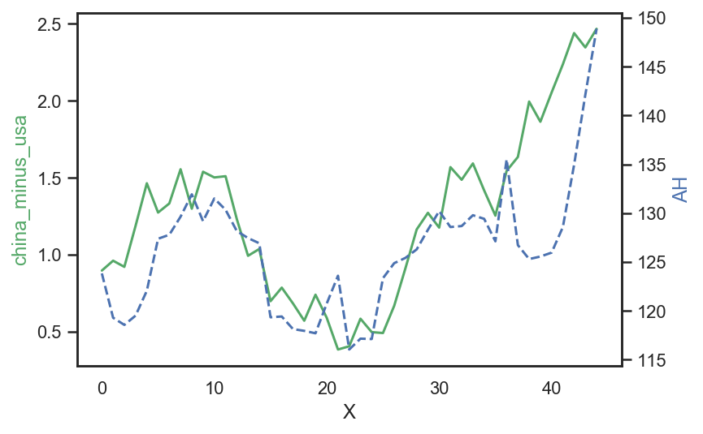
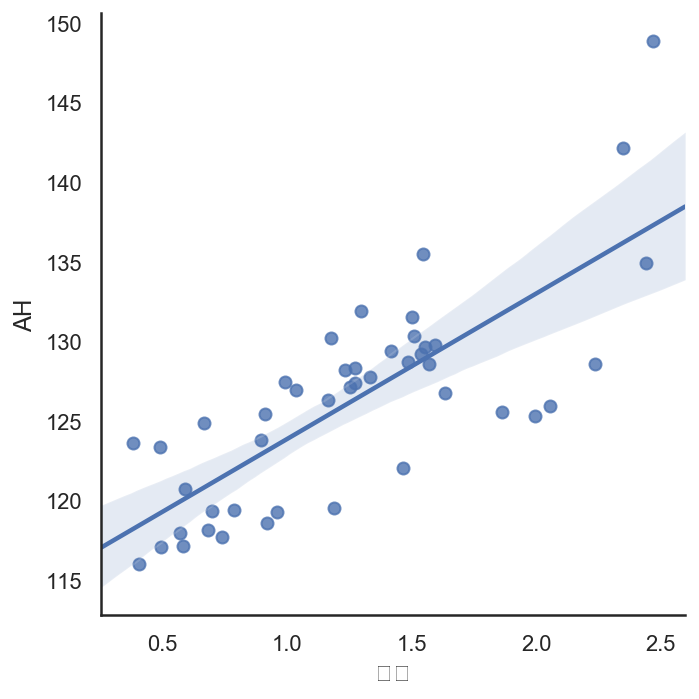

# 研究AH溢价和中美十年期国债利差之间的关系


```python
import numpy as np
import pandas as pd
import matplotlib.pyplot as plt
import seaborn as sns
%matplotlib inline
sns.set(style = "white")
%config InlineBackend.figure_format = 'retina'
```


```python
china_10_debt = pd.read_csv("F:/Chrome_downloads/china_10_debt.csv",header = [0])
usa_10_debt = pd.read_csv("F:/Chrome_downloads/usa_10_debt.csv",header = [0])
AH = pd.read_csv("F:/Chrome_downloads/AH.csv",header = [0])
```


```python
china_10_debt.index = list(range(45))[::-1]
usa_10_debt.index = list(range(45))[::-1]
AH.index = list(range(45))[::-1]
```


```python
china_minus_usa = china_10_debt["收盘"] - usa_10_debt["收盘"]
```


```python
x = np.arange(45)

fig,ax1 = plt.subplots()
ax2 = ax1.twinx()
ax1.plot(x,china_minus_usa[::-1],"g-")
ax2.plot(x,AH["收盘"][::-1],"b--")

ax1.set_xlabel("X")
ax1.set_ylabel("china_minus_usa",color = "g")
ax2.set_ylabel("AH",color = "b")
```


    Text(0, 0.5, 'AH')





```python
new_df = pd.DataFrame(china_minus_usa)
new_df["AH"] = AH["收盘"]
```


```python
sns.lmplot(x = "收盘",y = "AH" ,data = new_df)
```


    <seaborn.axisgrid.FacetGrid at 0x2ed203f0f88>





```python

```
