# 介绍：


```python
某公司2019年的游戏安全数据分析竞赛（初赛）

数据背景：
该游戏是个MOBA类型的游戏，有每个选手的每场比赛表现流水，目的是为了从这些比赛流水中找出代练账户

注：
1.由于原本的数据量过大（电脑跑不动），在这里分析的数据是原来的1/10，并且为了提高运行速度已经由csv转换为了npy格式
2.doing数据表示玩家在比赛中的行为流水，conseq数据表示玩家在比赛中的战绩流水
3.关于拟合模型的指标：
    分析label的两个值各占比例，可以看出这是个高度不对称数据，为1的样本量仅占11%左右。
    因此不适合用分类正确率来作为判断结果的参考，因为傻瓜分类器也能分类正确率高达89%
    根据题目要求要找到所谓“代练账户”，我认为召回率（所有真实显著样本中被检查出显著的样本数量/所有真实显著样本数量）越高越好
    假阳性率越低越好（即真实不显著样本数量/所有被检验出显著的样本数量）
    因此使用roc这一指标,照顾了这两者(通常假阳性和召回率同增同减,我希望前者小后者大,比如说检验越松散,往往召回率越高,但是假阳性比例也会越高)
    通常roc是越高越好，最大为1，超过0.8则不错了
    这题，傻瓜分类器全部预测为0，虽然正确率高达89%，但是召回率只有0
 4.官方的评分标准是：计算得分score=4PR/(P+3R)*100%，其中P为测试集预测结果整体的准确度，R表示测试集预测结果被判为代练的玩家在真实代练玩家中的覆盖度（召回率）
   要求召回率越高越好，同时假阳性率越低越好，因为不能把没开挂的人误封，这样非常不妥。
```


```python
总结：
模型在只有1/10的数据，没有使用时间型数据以及没有任何调参的情况下获得了0.83左右的AUC，效果还可以
```


```python
import pandas as pd
import numpy as np
import matplotlib.pyplot as plt
```

# 读取数据和给列命名


```python
data_conseq = np.load("data_conseq.npy",allow_pickle = True)
data_conseq = pd.DataFrame(data_conseq)
data_doing = np.load("data_doing.npy",allow_pickle = True)
data_doing = pd.DataFrame(data_doing)

#读取列名表格，conseq列为战绩流水列名，doing为行为流水列名
cn2 = pd.read_csv("col_name.csv",header = 0)
data_conseq.columns = cn2["conseq"].dropna().values
data_doing.columns = cn2["doing"].values
```


```python
data_conseq.head()
```


<div>
<style scoped>
    .dataframe tbody tr th:only-of-type {
        vertical-align: middle;
    }

    .dataframe tbody tr th {
        vertical-align: top;
    }

    .dataframe thead th {
        text-align: right;
    }
</style>
<table border="1" class="dataframe">
  <thead>
    <tr style="text-align: right;">
      <th></th>
      <th>uid</th>
      <th>worldid</th>
      <th>game_id</th>
      <th>game_mode</th>
      <th>battle_time</th>
      <th>champion_id</th>
      <th>team</th>
      <th>champions_killed</th>
      <th>num_deaths</th>
      <th>assists</th>
      <th>killing_spress</th>
      <th>game_score</th>
      <th>flag</th>
      <th>ext_flag</th>
      <th>champion_used_exp</th>
    </tr>
  </thead>
  <tbody>
    <tr>
      <td>0</td>
      <td>53441893</td>
      <td>75</td>
      <td>1123320262</td>
      <td>4</td>
      <td>2019-02-26 18:16:19</td>
      <td>53</td>
      <td>100</td>
      <td>4</td>
      <td>1</td>
      <td>5</td>
      <td>2</td>
      <td>1290</td>
      <td>8</td>
      <td>256</td>
      <td>21965</td>
    </tr>
    <tr>
      <td>1</td>
      <td>53441893</td>
      <td>75</td>
      <td>1123339985</td>
      <td>4</td>
      <td>2019-02-26 20:49:07</td>
      <td>59</td>
      <td>200</td>
      <td>8</td>
      <td>5</td>
      <td>22</td>
      <td>3</td>
      <td>1290</td>
      <td>16</td>
      <td>0</td>
      <td>19212</td>
    </tr>
    <tr>
      <td>2</td>
      <td>53441893</td>
      <td>75</td>
      <td>1123594658</td>
      <td>4</td>
      <td>2019-02-27 18:37:56</td>
      <td>86</td>
      <td>200</td>
      <td>4</td>
      <td>2</td>
      <td>4</td>
      <td>1</td>
      <td>1010</td>
      <td>0</td>
      <td>1048832</td>
      <td>19632</td>
    </tr>
    <tr>
      <td>3</td>
      <td>53441893</td>
      <td>75</td>
      <td>1123613112</td>
      <td>4</td>
      <td>2019-02-27 18:10:09</td>
      <td>17</td>
      <td>200</td>
      <td>8</td>
      <td>0</td>
      <td>1</td>
      <td>1</td>
      <td>1270</td>
      <td>1</td>
      <td>1982720</td>
      <td>26778</td>
    </tr>
    <tr>
      <td>4</td>
      <td>53441893</td>
      <td>75</td>
      <td>1123665332</td>
      <td>4</td>
      <td>2019-02-27 21:12:45</td>
      <td>64</td>
      <td>200</td>
      <td>2</td>
      <td>6</td>
      <td>7</td>
      <td>0</td>
      <td>670</td>
      <td>24</td>
      <td>0</td>
      <td>20539</td>
    </tr>
  </tbody>
</table>
</div>


```python
data_doing.head()
```


<div>
<style scoped>
    .dataframe tbody tr th:only-of-type {
        vertical-align: middle;
    }

    .dataframe tbody tr th {
        vertical-align: top;
    }

    .dataframe thead th {
        text-align: right;
    }
</style>
<table border="1" class="dataframe">
  <thead>
    <tr style="text-align: right;">
      <th></th>
      <th>uid</th>
      <th>worldid</th>
      <th>game_id</th>
      <th>dtEvnetTime</th>
      <th>dtGameStartTime</th>
      <th>iMapID</th>
      <th>iDuration</th>
      <th>iBasegamemode</th>
      <th>iSubgamemode</th>
      <th>iExpChange</th>
      <th>...</th>
      <th>iTimeSpentDead</th>
      <th>iTurretsDestroyed</th>
      <th>iSpell1</th>
      <th>iSpell2</th>
      <th>Summoner_level</th>
      <th>Champion_id</th>
      <th>Predicted_win</th>
      <th>Premade</th>
      <th>Premade_size</th>
      <th>Elo_change</th>
    </tr>
  </thead>
  <tbody>
    <tr>
      <td>0</td>
      <td>4007318390</td>
      <td>74</td>
      <td>541101244</td>
      <td>2019-03-04 06:28:04</td>
      <td>2019-03-04 06:05:32</td>
      <td>11</td>
      <td>1352</td>
      <td>1</td>
      <td>4</td>
      <td>0</td>
      <td>...</td>
      <td>35</td>
      <td>2</td>
      <td>4</td>
      <td>14</td>
      <td>172</td>
      <td>91</td>
      <td>0.52301</td>
      <td>false</td>
      <td>1</td>
      <td>12</td>
    </tr>
    <tr>
      <td>1</td>
      <td>2928536459</td>
      <td>82</td>
      <td>1499793258</td>
      <td>2019-03-02 05:40:19</td>
      <td>2019-03-02 05:05:02</td>
      <td>11</td>
      <td>2117</td>
      <td>1</td>
      <td>4</td>
      <td>0</td>
      <td>...</td>
      <td>316</td>
      <td>0</td>
      <td>4</td>
      <td>14</td>
      <td>129</td>
      <td>99</td>
      <td>0.52301</td>
      <td>false</td>
      <td>2</td>
      <td>-13</td>
    </tr>
    <tr>
      <td>2</td>
      <td>2945527479</td>
      <td>84</td>
      <td>1542251694</td>
      <td>2019-03-06 12:31:01</td>
      <td>2019-03-06 11:59:17</td>
      <td>11</td>
      <td>1904</td>
      <td>1</td>
      <td>4</td>
      <td>0</td>
      <td>...</td>
      <td>178</td>
      <td>0</td>
      <td>4</td>
      <td>7</td>
      <td>218</td>
      <td>40</td>
      <td>0.528751</td>
      <td>false</td>
      <td>1</td>
      <td>12</td>
    </tr>
    <tr>
      <td>3</td>
      <td>2953484894</td>
      <td>90</td>
      <td>1297110042</td>
      <td>2019-03-02 16:40:50</td>
      <td>2019-03-02 16:11:05</td>
      <td>11</td>
      <td>1785</td>
      <td>1</td>
      <td>4</td>
      <td>0</td>
      <td>...</td>
      <td>236</td>
      <td>1</td>
      <td>4</td>
      <td>7</td>
      <td>33</td>
      <td>67</td>
      <td>0.475555</td>
      <td>false</td>
      <td>1</td>
      <td>-12</td>
    </tr>
    <tr>
      <td>4</td>
      <td>2959141576</td>
      <td>98</td>
      <td>2706982848</td>
      <td>2019-03-03 13:19:43</td>
      <td>2019-03-03 12:52:03</td>
      <td>11</td>
      <td>1660</td>
      <td>1</td>
      <td>4</td>
      <td>0</td>
      <td>...</td>
      <td>235</td>
      <td>2</td>
      <td>4</td>
      <td>14</td>
      <td>174</td>
      <td>517</td>
      <td>0.525881</td>
      <td>false</td>
      <td>1</td>
      <td>12</td>
    </tr>
  </tbody>
</table>
<p>5 rows × 37 columns</p>
</div>


```python
#为id列命名
train_id = np.load("train_id.npy",allow_pickle = True)
train_id = pd.DataFrame(train_id)
train_id.columns = ['uid',"worldid","label"]

test_id = np.load("test_id.npy",allow_pickle = True)
test_id = pd.DataFrame(test_id)
test_id.columns = ['uid',"worldid"]
```


```python
train_id.head()
```


<div>
<style scoped>
    .dataframe tbody tr th:only-of-type {
        vertical-align: middle;
    }

    .dataframe tbody tr th {
        vertical-align: top;
    }

    .dataframe thead th {
        text-align: right;
    }
</style>
<table border="1" class="dataframe">
  <thead>
    <tr style="text-align: right;">
      <th></th>
      <th>uid</th>
      <th>worldid</th>
      <th>label</th>
    </tr>
  </thead>
  <tbody>
    <tr>
      <td>0</td>
      <td>4016310399</td>
      <td>69</td>
      <td>0</td>
    </tr>
    <tr>
      <td>1</td>
      <td>4016310949</td>
      <td>69</td>
      <td>1</td>
    </tr>
    <tr>
      <td>2</td>
      <td>4016311184</td>
      <td>69</td>
      <td>1</td>
    </tr>
    <tr>
      <td>3</td>
      <td>4016311766</td>
      <td>69</td>
      <td>1</td>
    </tr>
    <tr>
      <td>4</td>
      <td>4016311933</td>
      <td>69</td>
      <td>0</td>
    </tr>
  </tbody>
</table>
</div>


```python
train_id.shape
```


    (121684, 3)


```python
test_id.head()
```


<div>
<style scoped>
    .dataframe tbody tr th:only-of-type {
        vertical-align: middle;
    }

    .dataframe tbody tr th {
        vertical-align: top;
    }

    .dataframe thead th {
        text-align: right;
    }
</style>
<table border="1" class="dataframe">
  <thead>
    <tr style="text-align: right;">
      <th></th>
      <th>uid</th>
      <th>worldid</th>
    </tr>
  </thead>
  <tbody>
    <tr>
      <td>0</td>
      <td>4016310262</td>
      <td>69</td>
    </tr>
    <tr>
      <td>1</td>
      <td>4016319171</td>
      <td>69</td>
    </tr>
    <tr>
      <td>2</td>
      <td>4016319442</td>
      <td>69</td>
    </tr>
    <tr>
      <td>3</td>
      <td>4016321122</td>
      <td>69</td>
    </tr>
    <tr>
      <td>4</td>
      <td>4016322431</td>
      <td>69</td>
    </tr>
  </tbody>
</table>
</div>


```python
test_id.shape
```


    (10000, 2)


```python
#删除doing的一些无用列
#判断为无用列的标准：所有样本的该值都相等，没有变化
data_doing = data_doing.drop(columns = ["iMapID","iBasegamemode","iExpChange","iSubgamemode","Premade"],axis = 1)
```


```python
#删除conseq的一些无用列(所有样本的该值都相等)
data_conseq = data_conseq.drop(columns = ["game_mode"],axis = 1)
```

# 合并doing和conseq表格，根据三个key：uid，worldid，game_id


```python
%%time
all_data = pd.merge(data_doing,data_conseq,how="inner",on = ['uid',"worldid","game_id"])
print()
```

    
    Wall time: 10.9 s
    


```python
all_data.head()
```


<div>
<style scoped>
    .dataframe tbody tr th:only-of-type {
        vertical-align: middle;
    }

    .dataframe tbody tr th {
        vertical-align: top;
    }

    .dataframe thead th {
        text-align: right;
    }
</style>
<table border="1" class="dataframe">
  <thead>
    <tr style="text-align: right;">
      <th></th>
      <th>uid</th>
      <th>worldid</th>
      <th>game_id</th>
      <th>dtEvnetTime</th>
      <th>dtGameStartTime</th>
      <th>iDuration</th>
      <th>iExpTotal</th>
      <th>iMoneyTotal</th>
      <th>iMoneyChange</th>
      <th>iRankInGame</th>
      <th>...</th>
      <th>champion_id</th>
      <th>team</th>
      <th>champions_killed</th>
      <th>num_deaths</th>
      <th>assists</th>
      <th>killing_spress</th>
      <th>game_score</th>
      <th>flag</th>
      <th>ext_flag</th>
      <th>champion_used_exp</th>
    </tr>
  </thead>
  <tbody>
    <tr>
      <td>0</td>
      <td>4007318390</td>
      <td>74</td>
      <td>541101244</td>
      <td>2019-03-04 06:28:04</td>
      <td>2019-03-04 06:05:32</td>
      <td>1352</td>
      <td>2314</td>
      <td>0</td>
      <td>58393</td>
      <td>1150</td>
      <td>...</td>
      <td>91</td>
      <td>200</td>
      <td>10</td>
      <td>3</td>
      <td>5</td>
      <td>2</td>
      <td>850</td>
      <td>0</td>
      <td>1048832</td>
      <td>18238</td>
    </tr>
    <tr>
      <td>1</td>
      <td>2928536459</td>
      <td>82</td>
      <td>1499793258</td>
      <td>2019-03-02 05:40:19</td>
      <td>2019-03-02 05:05:02</td>
      <td>2117</td>
      <td>423</td>
      <td>0</td>
      <td>11703</td>
      <td>1138</td>
      <td>...</td>
      <td>99</td>
      <td>200</td>
      <td>6</td>
      <td>12</td>
      <td>14</td>
      <td>1</td>
      <td>770</td>
      <td>16</td>
      <td>512</td>
      <td>9908</td>
    </tr>
    <tr>
      <td>2</td>
      <td>2945527479</td>
      <td>84</td>
      <td>1542251694</td>
      <td>2019-03-06 12:31:01</td>
      <td>2019-03-06 11:59:17</td>
      <td>1904</td>
      <td>1636</td>
      <td>0</td>
      <td>240813</td>
      <td>1232</td>
      <td>...</td>
      <td>40</td>
      <td>200</td>
      <td>1</td>
      <td>6</td>
      <td>19</td>
      <td>0</td>
      <td>470</td>
      <td>16</td>
      <td>66560</td>
      <td>15438</td>
    </tr>
    <tr>
      <td>3</td>
      <td>2953484894</td>
      <td>90</td>
      <td>1297110042</td>
      <td>2019-03-02 16:40:50</td>
      <td>2019-03-02 16:11:05</td>
      <td>1785</td>
      <td>2092</td>
      <td>0</td>
      <td>2107</td>
      <td>1067</td>
      <td>...</td>
      <td>67</td>
      <td>100</td>
      <td>6</td>
      <td>9</td>
      <td>5</td>
      <td>2</td>
      <td>770</td>
      <td>28</td>
      <td>2097668</td>
      <td>7804</td>
    </tr>
    <tr>
      <td>4</td>
      <td>2959141576</td>
      <td>98</td>
      <td>2706982848</td>
      <td>2019-03-03 13:19:43</td>
      <td>2019-03-03 12:52:03</td>
      <td>1660</td>
      <td>2149</td>
      <td>0</td>
      <td>21834</td>
      <td>1519</td>
      <td>...</td>
      <td>517</td>
      <td>200</td>
      <td>3</td>
      <td>8</td>
      <td>9</td>
      <td>1</td>
      <td>800</td>
      <td>16</td>
      <td>0</td>
      <td>15458</td>
    </tr>
  </tbody>
</table>
<p>5 rows × 43 columns</p>
</div>


# 合并train_id和all_data


```python
#合并train_id
da_withtr = pd.merge(all_data,train_id,how = "inner",on = ["uid","worldid"])
```


```python
train_id.shape
```


    (121684, 3)


```python
#da_withtr的行数远远多于train_id的行数，所以可以很明显看出，一个id有多场比赛
da_withtr.shape
```


    (337397, 44)


```python
#指定列，该列有na的就删了对应行
da_withtr = da_withtr.dropna(subset = ["dtGameStartTime"])
```


```python
da_withtr.shape #此时的样本量已经变得和data_doing一样
```


    (337397, 44)


# 处datetime特征列


```python
da_withtr["dtEvnetTime"] = pd.to_datetime(da_withtr["dtEvnetTime"],format = "%Y-%m-%d %H:%M:%S")
da_withtr["dtGameStartTime"] = pd.to_datetime(da_withtr["dtGameStartTime"],format = "%Y-%m-%d %H:%M:%S")
#battle_time指的是对局开始时间，比dtGameStartTime一般略早一点
da_withtr["battle_time"] = pd.to_datetime(da_withtr["battle_time"],format = "%Y-%m-%d %H:%M:%S")
```


```python
da_withtr.loc[(da_withtr["dtGameStartTime"].dt.month==3) & (da_withtr["dtGameStartTime"].dt.day>=7)]["dtGameStartTime"]
#最远的游戏时间记录就是在3月7日
```


    9        2019-03-07 14:40:05
    11       2019-03-07 04:14:44
    13       2019-03-07 09:42:16
    18       2019-03-07 11:25:30
    30       2019-03-07 12:11:53
                     ...        
    337383   2019-03-07 00:11:14
    337387   2019-03-07 13:56:05
    337388   2019-03-07 20:59:58
    337391   2019-03-07 15:46:10
    337396   2019-03-07 21:36:10
    Name: dtGameStartTime, Length: 61680, dtype: datetime64[ns]


# 提取特征


```python
game_data = da_withtr.copy()
```


```python
#champion_id和Champion_id重复，只保留一个即可
game_data = game_data.drop(columns = ["Champion_id"],axis = 1)[:] 

#iMoney_Total全是0，删除
game_data = game_data.drop(columns = ["iMoneyTotal"],axis = 1)[:]
```


```python
game_data.info()
```

    <class 'pandas.core.frame.DataFrame'>
    Int64Index: 337397 entries, 0 to 337396
    Data columns (total 42 columns):
    uid                       337397 non-null int64
    worldid                   337397 non-null int64
    game_id                   337397 non-null int64
    dtEvnetTime               337397 non-null datetime64[ns]
    dtGameStartTime           337397 non-null datetime64[ns]
    iDuration                 337397 non-null int64
    iExpTotal                 337397 non-null int64
    iMoneyChange              337397 non-null int64
    iRankInGame               337397 non-null int64
    iLeaver                   337397 non-null int64
    iDamgeDealt               337397 non-null int64
    iDamageTaken              337397 non-null int64
    iGoldEarned               337397 non-null int64
    iHealingDone              337397 non-null int64
    iLargestKillingSpree      337397 non-null int64
    iLargestMultiKill         337397 non-null int64
    iMagicDamageDealt         337397 non-null int64
    iMagicDamageTaken         337397 non-null int64
    iMinionsKilled            337397 non-null int64
    iNeutralMonsterKills      337397 non-null int64
    iPhysical Damage Dealt    337397 non-null int64
    iPhysicalDamageTaken      337397 non-null int64
    iTimeSpentDead            337397 non-null int64
    iTurretsDestroyed         337397 non-null int64
    iSpell1                   337397 non-null int64
    iSpell2                   337397 non-null int64
    Summoner_level            337397 non-null int64
    Predicted_win             337397 non-null float64
    Premade_size              337397 non-null int64
    Elo_change                337397 non-null int64
    battle_time               337397 non-null datetime64[ns]
    champion_id               337397 non-null int64
    team                      337397 non-null int64
    champions_killed          337397 non-null int64
    num_deaths                337397 non-null int64
    assists                   337397 non-null int64
    killing_spress            337397 non-null int64
    game_score                337397 non-null int64
    flag                      337397 non-null int64
    ext_flag                  337397 non-null int64
    champion_used_exp         337397 non-null int64
    label                     337397 non-null int64
    dtypes: datetime64[ns](3), float64(1), int64(38)
    memory usage: 110.7 MB
    


```python
#team特征比较复杂，同个数值代表同个team，需要是同一场比赛
game_data["team"]
```


    0         200
    1         200
    2         200
    3         100
    4         200
             ... 
    337392    200
    337393    200
    337394    200
    337395    100
    337396    200
    Name: team, Length: 337397, dtype: int64


```python
#id特征
id_att = ["uid","worldid","game_id"]

#数值型特征
num_att = ["champions_killed","num_deaths","assists","game_score","champion_used_exp",
          "iDuration","iExpTotal","iMoneyChange","iRankInGame",
          "iDamgeDealt","iDamageTaken","iGoldEarned","iHealingDone","iLargestKillingSpree",
          "iMagicDamageDealt","iMagicDamageTaken","iMinionsKilled","iNeutralMonsterKills","iPhysical Damage Dealt",
          "iPhysicalDamageTaken","iTimeSpentDead"]

#分类特征
cat_att = ["champion_id","team","iLeaver","iSpell1","iSpell2","killing_spress","iLargestMultiKill","iTurretsDestroyed"]

#难以分析的特征，需要由16进制转回2进制？但是又不能理解类型太多和题目提供的不符合，可能需要解码（被加密了）
complex_att_0x = ["flag","ext_flag"]

#日期型特征
date_att = list(game_data.select_dtypes(include = ["datetime64[ns]"]).columns)

#目标特征，0表示非代练，1表示代练
y_att = ["label"]
```

# 可视化观察


```python
game_data[num_att[0:4]].hist(bins = 50)
```


    array([[<matplotlib.axes._subplots.AxesSubplot object at 0x000001B685270388>,
            <matplotlib.axes._subplots.AxesSubplot object at 0x000001B685015288>],
           [<matplotlib.axes._subplots.AxesSubplot object at 0x000001B68502C948>,
            <matplotlib.axes._subplots.AxesSubplot object at 0x000001B685063388>]],
          dtype=object)


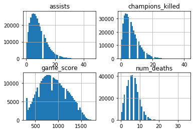


```python
game_data[num_att[4:8]].hist(bins = 50)
```


    array([[<matplotlib.axes._subplots.AxesSubplot object at 0x000001B6851BE688>,
            <matplotlib.axes._subplots.AxesSubplot object at 0x000001B685419208>],
           [<matplotlib.axes._subplots.AxesSubplot object at 0x000001B68543A908>,
            <matplotlib.axes._subplots.AxesSubplot object at 0x000001B685472348>]],
          dtype=object)


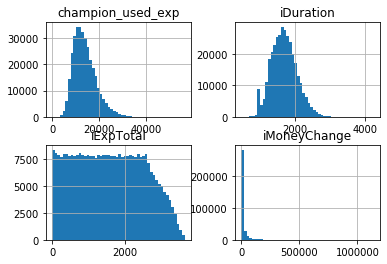


```python
game_data[num_att[8:12]].hist(bins = 50)
```


    array([[<matplotlib.axes._subplots.AxesSubplot object at 0x000001B685739C88>,
            <matplotlib.axes._subplots.AxesSubplot object at 0x000001B69E4174C8>],
           [<matplotlib.axes._subplots.AxesSubplot object at 0x000001B69E433B88>,
            <matplotlib.axes._subplots.AxesSubplot object at 0x000001B69E46D5C8>]],
          dtype=object)


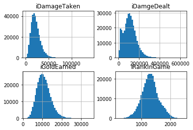


```python
game_data[num_att[12:16]].hist(bins = 50)
```


    array([[<matplotlib.axes._subplots.AxesSubplot object at 0x000001B69E66F388>,
            <matplotlib.axes._subplots.AxesSubplot object at 0x000001B69E778E88>],
           [<matplotlib.axes._subplots.AxesSubplot object at 0x000001B69E795F08>,
            <matplotlib.axes._subplots.AxesSubplot object at 0x000001B69E7CF948>]],
          dtype=object)


```python
game_data[num_att[16:]].hist(bins = 50)
```


    array([[<matplotlib.axes._subplots.AxesSubplot object at 0x000001B69E877588>,
            <matplotlib.axes._subplots.AxesSubplot object at 0x000001B69EB17C88>],
           [<matplotlib.axes._subplots.AxesSubplot object at 0x000001B69EB3A448>,
            <matplotlib.axes._subplots.AxesSubplot object at 0x000001B69EB6FE48>],
           [<matplotlib.axes._subplots.AxesSubplot object at 0x000001B69EBA7848>,
            <matplotlib.axes._subplots.AxesSubplot object at 0x000001B69EBE06C8>]],
          dtype=object)


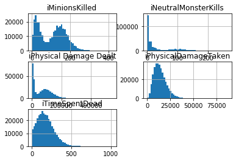


# 观察代练账户和非代练账号的数据


```python
#什么是代练账号：
#高水平玩家通过（代练）平台接单，使用被代练玩家的账号打段位赛升级，这个账号就是代练账号
```


```python
#大部分人的比赛次数只有1~3场，超过这个数字的就很少了
game_data["game_score"].groupby([game_data["uid"],game_data["worldid"]]).count().hist(bins=30)
```


    <matplotlib.axes._subplots.AxesSubplot at 0x1c2042c7708>


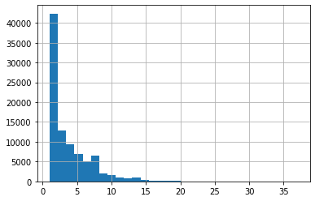


```python
#可以看到:大部分人的比赛次数只有1~3场，超过这个数字的就很少了
game_data["game_score"].groupby([game_data["uid"],game_data["worldid"]]).count().value_counts()
```


    1     24645
    2     17723
    3     12862
    4      9469
    5      6886
    6      5032
    7      3720
    8      2732
    9      2034
    10     1570
    11     1083
    12      743
    13      594
    14      406
    15      335
    16      220
    17      172
    18      124
    19      103
    20       57
    21       47
    22       26
    23       20
    24       17
    27        7
    25        6
    28        6
    26        4
    29        4
    34        1
    30        1
    32        1
    37        1
    Name: game_score, dtype: int64


```python
#找出打了k场游戏那些人的uid和game_id
def check_game_times(k = 24):
    x = []
    for i,val in enumerate((game_data["game_score"].groupby([game_data["uid"],game_data["worldid"]]).count()==k).values):
        if val == True:
            x.append(i)
    return x
```


```python
#随便看看，比如说看看打了24场排位的那17人是什么情况
t = check_game_times(k = 24)
```


```python
df_24 = pd.DataFrame()
indexes = game_data["game_score"].groupby([game_data["uid"],game_data["worldid"]]).count()[t].index
for index in indexes:
    df_24 = df_24.append(game_data[(game_data["uid"] == index[0])&(game_data["worldid"]==index[1])][id_att+cat_att+y_att])
```


```python
df_24.head()
```


<div>
<style scoped>
    .dataframe tbody tr th:only-of-type {
        vertical-align: middle;
    }

    .dataframe tbody tr th {
        vertical-align: top;
    }

    .dataframe thead th {
        text-align: right;
    }
</style>
<table border="1" class="dataframe">
  <thead>
    <tr style="text-align: right;">
      <th></th>
      <th>uid</th>
      <th>worldid</th>
      <th>game_id</th>
      <th>champion_id</th>
      <th>team</th>
      <th>iLeaver</th>
      <th>iSpell1</th>
      <th>iSpell2</th>
      <th>killing_spress</th>
      <th>iLargestMultiKill</th>
      <th>iTurretsDestroyed</th>
      <th>label</th>
    </tr>
  </thead>
  <tbody>
    <tr>
      <td>53131</td>
      <td>2927731496</td>
      <td>86</td>
      <td>3750405051</td>
      <td>157</td>
      <td>200</td>
      <td>0</td>
      <td>4</td>
      <td>14</td>
      <td>4</td>
      <td>2</td>
      <td>0</td>
      <td>0</td>
    </tr>
    <tr>
      <td>53132</td>
      <td>2927731496</td>
      <td>86</td>
      <td>3749185060</td>
      <td>157</td>
      <td>200</td>
      <td>0</td>
      <td>4</td>
      <td>14</td>
      <td>3</td>
      <td>1</td>
      <td>0</td>
      <td>0</td>
    </tr>
    <tr>
      <td>53133</td>
      <td>2927731496</td>
      <td>86</td>
      <td>3767274498</td>
      <td>64</td>
      <td>200</td>
      <td>0</td>
      <td>4</td>
      <td>11</td>
      <td>1</td>
      <td>1</td>
      <td>1</td>
      <td>0</td>
    </tr>
    <tr>
      <td>53134</td>
      <td>2927731496</td>
      <td>86</td>
      <td>3748925287</td>
      <td>64</td>
      <td>100</td>
      <td>0</td>
      <td>4</td>
      <td>11</td>
      <td>1</td>
      <td>1</td>
      <td>0</td>
      <td>0</td>
    </tr>
    <tr>
      <td>53135</td>
      <td>2927731496</td>
      <td>86</td>
      <td>3752564752</td>
      <td>59</td>
      <td>200</td>
      <td>0</td>
      <td>4</td>
      <td>11</td>
      <td>3</td>
      <td>2</td>
      <td>1</td>
      <td>0</td>
    </tr>
  </tbody>
</table>
</div>


```python
df_24[df_24["label"] == 0]["iLeaver"].value_counts()
```


    0    336
    Name: iLeaver, dtype: int64


```python
df_24[df_24["label"] == 1]["iLeaver"].value_counts()
```


    0    72
    Name: iLeaver, dtype: int64


# 将label为1的聚集到一起，label为0的聚集到一起，分别看看他们的不同

思路：看它们的直方图是否相同，差距是否很大，如果差距很大说明这个特征可能有一定作用

注：这里只给出了iLargestMultiKill的部分统计量提取作为例子，其余均省略，直接跳到最终提取结果

***先看分类特征***


```python
game_data[game_data["label"]==1]["iLargestMultiKill"].hist(bins = 5)
```


    <matplotlib.axes._subplots.AxesSubplot at 0x258877d8348>


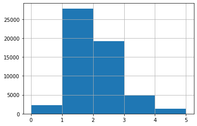


```python
game_data[game_data["label"]==0]["iLargestMultiKill"].hist(bins = 5)
```


    <matplotlib.axes._subplots.AxesSubplot at 0x25887844188>


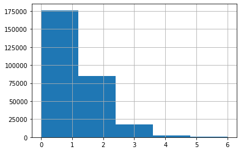


```python
sum_label_0 = game_data[game_data["label"]==0].shape[0]
game_data[game_data["label"]==0]["iLargestMultiKill"].value_counts().sort_index()/sum_label_0
```


    0    0.043362
    1    0.581256
    2    0.301341
    3    0.061854
    4    0.009888
    5    0.002295
    6    0.000004
    Name: iLargestMultiKill, dtype: float64


```python
sum_label_1 = game_data[game_data["label"]==1].shape[0]
game_data[game_data["label"]==1]["iLargestMultiKill"].value_counts().sort_index()/sum_label_1
```


    0    0.040419
    1    0.502615
    2    0.346458
    3    0.087854
    4    0.017784
    5    0.004870
    Name: iLargestMultiKill, dtype: float64


```python
game_data[game_data["label"]==0][id_att+["iLargestMultiKill"]].groupby([game_data["uid"],game_data["worldid"]]).max()\
["iLargestMultiKill"].hist(bins = 10)
```


    <matplotlib.axes._subplots.AxesSubplot at 0x26b0a2f30c8>


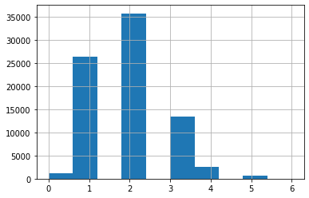


```python
game_data[game_data["label"]==1][id_att+["iLargestMultiKill"]].groupby([game_data["uid"],game_data["worldid"]]).max()\
["iLargestMultiKill"].hist(bins = 10)
```


    <matplotlib.axes._subplots.AxesSubplot at 0x26b0a350288>


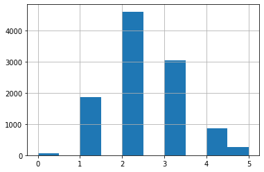


值的一看的类别特征只有iLargestMultiKill特征,其他类别特征的直方图都类似

准备提取的特征：

1.最大连杀次数的最大值 2.某选手3次或者4次及以上最大连杀次数占总比赛数目的比例；

数值型特征


```python
num_att[20:]
```


    ['iTimeSpentDead']


```python
game_data[game_data["label"]== 0][num_att[20:]].hist(bins = 30)
```


    array([[<matplotlib.axes._subplots.AxesSubplot object at 0x00000263A06BA148>]],
          dtype=object)


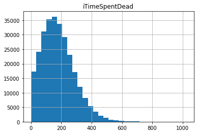


```python
game_data[game_data["label"]== 1][num_att[20:]].hist(bins = 30)
```


    array([[<matplotlib.axes._subplots.AxesSubplot object at 0x000001FFD26288C8>]],
          dtype=object)


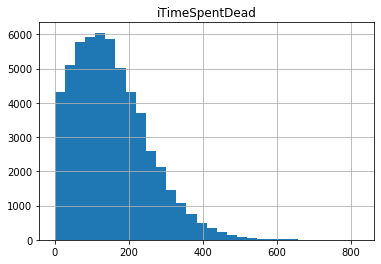


```python
game_data[game_data["label"]==0][id_att+["iTimeSpentDead"]].groupby([game_data["uid"],game_data["worldid"]]).mean()\
["iTimeSpentDead"].hist(bins = 30)
```


    <matplotlib.axes._subplots.AxesSubplot at 0x1ffd241ccc8>


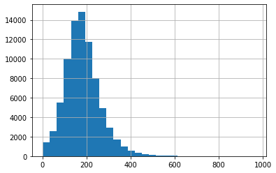


```python
game_data[game_data["label"]==1][id_att+["iTimeSpentDead"]].groupby([game_data["uid"],game_data["worldid"]]).mean()\
["iTimeSpentDead"].hist(bins = 30)
```


    <matplotlib.axes._subplots.AxesSubplot at 0x1ffd24c5448>


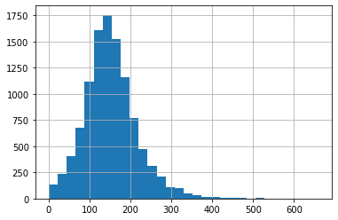


```python
#补充统计量：某个特征在某个账号下的极差（最大值减去最小值）
#ctr即为count the range的缩写
def ctr(data = game_data,att = "game_score",label = 0):
    max_val = data[data["label"]==label][id_att+[att]].groupby([data["uid"],data["worldid"]]).max()
    min_val = data[data["label"]==label][id_att+[att]].groupby([data["uid"],data["worldid"]]).min()
    rge = max_val - min_val
    return rge

def ctr2(data = game_data,att = "game_score"):
    max_val = data.groupby([data["uid"],data["worldid"]]).max()[att]
    min_val = data.groupby([data["uid"],data["worldid"]]).min()[att]
    rge = max_val - min_val
    return rge
```


```python
ctr(att = "iMagicDamageDealt")["iMagicDamageDealt"].hist()
```


    <matplotlib.axes._subplots.AxesSubplot at 0x20d431eab88>


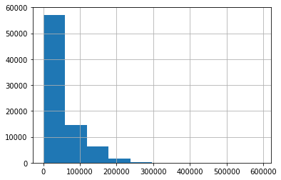


```python
ctr(att = "iMagicDamageDealt",label = 1)["iMagicDamageDealt"].hist()
```


    <matplotlib.axes._subplots.AxesSubplot at 0x20d4327c088>


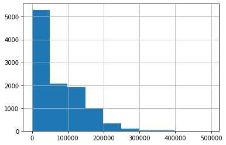


```python
#备注，还差一个特征：某选手3次或者4次及以上iLargestMultiKill占总比赛数目的比例；
```


```python
#需要简单统计量的特征
need_max_att = ["game_score","num_deaths","iLargestMultiKill","champion_used_exp","iLargestKillingSpree","iMagicDamageDealt"]
need_median_att  = ["champions_killed"]
need_min_att = ["champions_killed","iDuration"]
need_mean_att = ["iExpTotal","iRankInGame"]
need_std_att = ["iDuration"]

#稍微复杂一点的统计量，如极差
#这类特征主要是从简单统计量的特征里面找的，没有选进简单统计量的特征暂时没有考虑
need_range_att = ["game_score","num_deaths","iLargestMultiKill","iMagicDamageDealt","champions_killed","iDuration","iExpTotal"]
```

***开始提取特征...***


```python
max_df = game_data.groupby([game_data["uid"],game_data["worldid"]]).max()[need_max_att]

new_name = []
for name in need_max_att:
    new_name.append(name+"_max")

max_df.columns = new_name
```


```python
median_df = game_data.groupby([game_data["uid"],game_data["worldid"]]).median()[need_median_att]

new_name = []
for name in need_median_att:
    new_name.append(name+"_median")
    
median_df.columns = new_name
```


```python
min_df = game_data.groupby([game_data["uid"],game_data["worldid"]]).min()[need_min_att]

new_name = []
for name in need_min_att:
    new_name.append(name+"_min")
    
min_df.columns = new_name
```


```python
mean_df = game_data.groupby([game_data["uid"],game_data["worldid"]]).mean()[need_mean_att]

new_name = []
for name in need_mean_att:
    new_name.append(name+"_mean")
    
mean_df.columns = new_name
```


```python
std_df = game_data.groupby([game_data["uid"],game_data["worldid"]]).std()[need_std_att]

new_name = []
for name in need_std_att:
    new_name.append(name+"_std")
    
std_df.columns = new_name
```


```python
range_df = pd.DataFrame()

for i in range(len(need_range_att)):
    df_temp = pd.DataFrame(ctr2(att = need_range_att[i]))
    range_df = pd.concat([range_df,df_temp],axis = 1)[:]

new_name = []
for name in need_range_att:
    new_name.append(name+"_range")
    
range_df.columns = new_name
```


```python
all_need_att = pd.concat([max_df,median_df,min_df,mean_df,std_df,range_df],axis =1)[:]
```


```python
all_need_att.head()
```


<div>
<style scoped>
    .dataframe tbody tr th:only-of-type {
        vertical-align: middle;
    }

    .dataframe tbody tr th {
        vertical-align: top;
    }

    .dataframe thead th {
        text-align: right;
    }
</style>
<table border="1" class="dataframe">
  <thead>
    <tr style="text-align: right;">
      <th></th>
      <th></th>
      <th>game_score_max</th>
      <th>num_deaths_max</th>
      <th>iLargestMultiKill_max</th>
      <th>champion_used_exp_max</th>
      <th>iLargestKillingSpree_max</th>
      <th>iMagicDamageDealt_max</th>
      <th>champions_killed_median</th>
      <th>champions_killed_min</th>
      <th>iDuration_min</th>
      <th>iExpTotal_mean</th>
      <th>iRankInGame_mean</th>
      <th>iDuration_std</th>
      <th>game_score_range</th>
      <th>num_deaths_range</th>
      <th>iLargestMultiKill_range</th>
      <th>iMagicDamageDealt_range</th>
      <th>champions_killed_range</th>
      <th>iDuration_range</th>
      <th>iExpTotal_range</th>
    </tr>
    <tr>
      <th>uid</th>
      <th>worldid</th>
      <th></th>
      <th></th>
      <th></th>
      <th></th>
      <th></th>
      <th></th>
      <th></th>
      <th></th>
      <th></th>
      <th></th>
      <th></th>
      <th></th>
      <th></th>
      <th></th>
      <th></th>
      <th></th>
      <th></th>
      <th></th>
      <th></th>
    </tr>
  </thead>
  <tbody>
    <tr>
      <td>53441893</td>
      <td>75</td>
      <td>1010</td>
      <td>5</td>
      <td>1</td>
      <td>26776</td>
      <td>4</td>
      <td>24954</td>
      <td>4.0</td>
      <td>0</td>
      <td>946</td>
      <td>1572.666667</td>
      <td>1460.000000</td>
      <td>331.161592</td>
      <td>540</td>
      <td>3</td>
      <td>1</td>
      <td>18663</td>
      <td>5</td>
      <td>630</td>
      <td>1541</td>
    </tr>
    <tr>
      <td>53499839</td>
      <td>73</td>
      <td>1170</td>
      <td>8</td>
      <td>2</td>
      <td>25393</td>
      <td>5</td>
      <td>7580</td>
      <td>10.5</td>
      <td>7</td>
      <td>1415</td>
      <td>1873.000000</td>
      <td>1557.000000</td>
      <td>317.490945</td>
      <td>320</td>
      <td>4</td>
      <td>1</td>
      <td>6916</td>
      <td>7</td>
      <td>449</td>
      <td>108</td>
    </tr>
    <tr>
      <td>53509485</td>
      <td>75</td>
      <td>1460</td>
      <td>11</td>
      <td>2</td>
      <td>16951</td>
      <td>7</td>
      <td>146412</td>
      <td>6.0</td>
      <td>2</td>
      <td>1462</td>
      <td>1257.000000</td>
      <td>1001.750000</td>
      <td>280.119745</td>
      <td>810</td>
      <td>8</td>
      <td>1</td>
      <td>140875</td>
      <td>9</td>
      <td>720</td>
      <td>2900</td>
    </tr>
    <tr>
      <td>53547389</td>
      <td>75</td>
      <td>1260</td>
      <td>8</td>
      <td>2</td>
      <td>16492</td>
      <td>6</td>
      <td>141425</td>
      <td>2.0</td>
      <td>0</td>
      <td>1379</td>
      <td>1519.000000</td>
      <td>1323.800000</td>
      <td>251.848566</td>
      <td>860</td>
      <td>7</td>
      <td>2</td>
      <td>125988</td>
      <td>16</td>
      <td>637</td>
      <td>2590</td>
    </tr>
    <tr>
      <td>53556293</td>
      <td>73</td>
      <td>1380</td>
      <td>11</td>
      <td>2</td>
      <td>28230</td>
      <td>4</td>
      <td>120535</td>
      <td>4.0</td>
      <td>0</td>
      <td>929</td>
      <td>1500.714286</td>
      <td>1589.214286</td>
      <td>327.765336</td>
      <td>1080</td>
      <td>11</td>
      <td>2</td>
      <td>118943</td>
      <td>13</td>
      <td>1258</td>
      <td>2485</td>
    </tr>
  </tbody>
</table>
</div>


```python
#获取label的值
label_att = game_data[["uid","worldid","label"]].drop_duplicates()
```


```python
#将label和特征数据集连接，准备开始建模
prepare_data = pd.merge(label_att,all_need_att,how = "inner",left_on =["uid","worldid"],right_index = True)[:]
```

# 尝试用gbdt观察效果

***注：这里只是简单地建立模型，没有通过各种融合还有调参***


```python
from sklearn.model_selection import train_test_split
from sklearn.ensemble import GradientBoostingClassifier
from sklearn.metrics import roc_auc_score
```


```python
#先不使用iDuration_std
X = prepare_data.drop(columns = ["uid","worldid","label","iDuration_std"]).copy()
y = prepare_data[["label"]].copy()
```


```python
X_train,X_val,y_train,y_val = train_test_split(X,y,test_size = 0.2,random_state = 42)
```


```python
gbdt = GradientBoostingClassifier(random_state = 42)
gbdt.fit(X_train,y_train)
```

    E:\Anaconda\lib\site-packages\sklearn\ensemble\gradient_boosting.py:1450: DataConversionWarning: A column-vector y was passed when a 1d array was expected. Please change the shape of y to (n_samples, ), for example using ravel().
      y = column_or_1d(y, warn=True)
    


    GradientBoostingClassifier(criterion='friedman_mse', init=None,
                               learning_rate=0.1, loss='deviance', max_depth=3,
                               max_features=None, max_leaf_nodes=None,
                               min_impurity_decrease=0.0, min_impurity_split=None,
                               min_samples_leaf=1, min_samples_split=2,
                               min_weight_fraction_leaf=0.0, n_estimators=100,
                               n_iter_no_change=None, presort='auto',
                               random_state=42, subsample=1.0, tol=0.0001,
                               validation_fraction=0.1, verbose=0,
                               warm_start=False)


```python
y_prob_gbdt = gbdt.predict_proba(X_val)[:,1]
roc_auc_score(y_val,y_prob_gbdt)
```


    0.8265317774516422


```python
#使用iDuration_std,这里NA值填充为0，因为NA是因为该账号只有一场比赛，标准差就是0
X2 = prepare_data.drop(columns = ["uid","worldid","label"]).copy().fillna(0)
y2 = prepare_data[["label"]].copy()
```


```python
X_train2,X_val2,y_train2,y_val2 = train_test_split(X2,y2,test_size = 0.2,random_state = 42)
```


```python
gbdt2 = GradientBoostingClassifier(random_state = 42)
gbdt2.fit(X_train2,y_train2)
```

    E:\Anaconda\lib\site-packages\sklearn\ensemble\gradient_boosting.py:1450: DataConversionWarning: A column-vector y was passed when a 1d array was expected. Please change the shape of y to (n_samples, ), for example using ravel().
      y = column_or_1d(y, warn=True)
    


    GradientBoostingClassifier(criterion='friedman_mse', init=None,
                               learning_rate=0.1, loss='deviance', max_depth=3,
                               max_features=None, max_leaf_nodes=None,
                               min_impurity_decrease=0.0, min_impurity_split=None,
                               min_samples_leaf=1, min_samples_split=2,
                               min_weight_fraction_leaf=0.0, n_estimators=100,
                               n_iter_no_change=None, presort='auto',
                               random_state=42, subsample=1.0, tol=0.0001,
                               validation_fraction=0.1, verbose=0,
                               warm_start=False)


```python
y_prob_gbdt2 = gbdt2.predict_proba(X_val2)[:,1]
roc_auc_score(y_val2,y_prob_gbdt2)
```


    0.8276026393646331


```python
#尝试用随机森林观察特征重要性
from sklearn.ensemble import RandomForestClassifier

X3 = prepare_data.drop(columns = ["uid","worldid","label"]).copy()
y3 = prepare_data[["label"]].copy()

X3 = X3.fillna(-999)

rf = RandomForestClassifier(random_state =42)
rf.fit(X3,y3)
```

    E:\Anaconda\lib\site-packages\sklearn\ensemble\forest.py:245: FutureWarning: The default value of n_estimators will change from 10 in version 0.20 to 100 in 0.22.
      "10 in version 0.20 to 100 in 0.22.", FutureWarning)
    E:\Anaconda\lib\site-packages\ipykernel_launcher.py:10: DataConversionWarning: A column-vector y was passed when a 1d array was expected. Please change the shape of y to (n_samples,), for example using ravel().
      # Remove the CWD from sys.path while we load stuff.
    


    RandomForestClassifier(bootstrap=True, class_weight=None, criterion='gini',
                           max_depth=None, max_features='auto', max_leaf_nodes=None,
                           min_impurity_decrease=0.0, min_impurity_split=None,
                           min_samples_leaf=1, min_samples_split=2,
                           min_weight_fraction_leaf=0.0, n_estimators=10,
                           n_jobs=None, oob_score=False, random_state=42, verbose=0,
                           warm_start=False)


```python
import matplotlib.pyplot as plt
plt.plot(rf.feature_importances_)
plt.xticks(np.arange(X3.shape[1]),X3.columns.tolist(), rotation=90)
```


    ([<matplotlib.axis.XTick at 0x2639cbdd608>,
      <matplotlib.axis.XTick at 0x2639cbd7c48>,
      <matplotlib.axis.XTick at 0x2639cbd7408>,
      <matplotlib.axis.XTick at 0x2639cc05448>,
      <matplotlib.axis.XTick at 0x2639cc05b08>,
      <matplotlib.axis.XTick at 0x2639cc08248>,
      <matplotlib.axis.XTick at 0x2639cc08bc8>,
      <matplotlib.axis.XTick at 0x2639cc0e548>,
      <matplotlib.axis.XTick at 0x2639cc11208>,
      <matplotlib.axis.XTick at 0x2639cc08048>,
      <matplotlib.axis.XTick at 0x2639cc117c8>,
      <matplotlib.axis.XTick at 0x2639cc16188>,
      <matplotlib.axis.XTick at 0x2639cc16ac8>,
      <matplotlib.axis.XTick at 0x2639cc1b448>,
      <matplotlib.axis.XTick at 0x2639cc1e088>,
      <matplotlib.axis.XTick at 0x2639cc1ea88>,
      <matplotlib.axis.XTick at 0x2639cc22588>,
      <matplotlib.axis.XTick at 0x2639cc26108>,
      <matplotlib.axis.XTick at 0x2639cc26b48>],
     <a list of 19 Text xticklabel objects>)


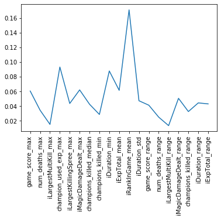


# 研究datetime相关的特征


```python
prepare_data
```


<div>
<style scoped>
    .dataframe tbody tr th:only-of-type {
        vertical-align: middle;
    }

    .dataframe tbody tr th {
        vertical-align: top;
    }

    .dataframe thead th {
        text-align: right;
    }
</style>
<table border="1" class="dataframe">
  <thead>
    <tr style="text-align: right;">
      <th></th>
      <th>uid</th>
      <th>worldid</th>
      <th>label</th>
      <th>game_score_max</th>
      <th>num_deaths_max</th>
      <th>iLargestMultiKill_max</th>
      <th>champion_used_exp_max</th>
      <th>iLargestKillingSpree_max</th>
      <th>iMagicDamageDealt_max</th>
      <th>champions_killed_median</th>
      <th>...</th>
      <th>iExpTotal_mean</th>
      <th>iRankInGame_mean</th>
      <th>iDuration_std</th>
      <th>game_score_range</th>
      <th>num_deaths_range</th>
      <th>iLargestMultiKill_range</th>
      <th>iMagicDamageDealt_range</th>
      <th>champions_killed_range</th>
      <th>iDuration_range</th>
      <th>iExpTotal_range</th>
    </tr>
  </thead>
  <tbody>
    <tr>
      <td>0</td>
      <td>2928536459</td>
      <td>82</td>
      <td>0</td>
      <td>1310</td>
      <td>12</td>
      <td>3</td>
      <td>19026</td>
      <td>7</td>
      <td>72067</td>
      <td>6.0</td>
      <td>...</td>
      <td>1546.857143</td>
      <td>1166.190476</td>
      <td>426.327797</td>
      <td>830</td>
      <td>9</td>
      <td>2</td>
      <td>67876</td>
      <td>15</td>
      <td>1385</td>
      <td>2595</td>
    </tr>
    <tr>
      <td>1</td>
      <td>2945527479</td>
      <td>84</td>
      <td>0</td>
      <td>1090</td>
      <td>9</td>
      <td>2</td>
      <td>19394</td>
      <td>3</td>
      <td>75287</td>
      <td>3.0</td>
      <td>...</td>
      <td>1959.000000</td>
      <td>1246.750000</td>
      <td>318.223585</td>
      <td>640</td>
      <td>6</td>
      <td>1</td>
      <td>64535</td>
      <td>5</td>
      <td>758</td>
      <td>1417</td>
    </tr>
    <tr>
      <td>2</td>
      <td>2953484894</td>
      <td>90</td>
      <td>0</td>
      <td>770</td>
      <td>9</td>
      <td>2</td>
      <td>7804</td>
      <td>2</td>
      <td>498</td>
      <td>6.0</td>
      <td>...</td>
      <td>2092.000000</td>
      <td>1067.000000</td>
      <td>NaN</td>
      <td>0</td>
      <td>0</td>
      <td>0</td>
      <td>0</td>
      <td>0</td>
      <td>0</td>
      <td>0</td>
    </tr>
    <tr>
      <td>3</td>
      <td>2959141576</td>
      <td>98</td>
      <td>0</td>
      <td>1370</td>
      <td>10</td>
      <td>2</td>
      <td>20295</td>
      <td>5</td>
      <td>139081</td>
      <td>2.0</td>
      <td>...</td>
      <td>1056.352941</td>
      <td>1476.941176</td>
      <td>351.998851</td>
      <td>1070</td>
      <td>10</td>
      <td>2</td>
      <td>139081</td>
      <td>13</td>
      <td>1247</td>
      <td>2296</td>
    </tr>
    <tr>
      <td>4</td>
      <td>4005924015</td>
      <td>93</td>
      <td>1</td>
      <td>1330</td>
      <td>14</td>
      <td>2</td>
      <td>13323</td>
      <td>5</td>
      <td>129842</td>
      <td>5.5</td>
      <td>...</td>
      <td>1702.000000</td>
      <td>1518.600000</td>
      <td>284.222546</td>
      <td>800</td>
      <td>13</td>
      <td>2</td>
      <td>127225</td>
      <td>11</td>
      <td>989</td>
      <td>2755</td>
    </tr>
    <tr>
      <td>...</td>
      <td>...</td>
      <td>...</td>
      <td>...</td>
      <td>...</td>
      <td>...</td>
      <td>...</td>
      <td>...</td>
      <td>...</td>
      <td>...</td>
      <td>...</td>
      <td>...</td>
      <td>...</td>
      <td>...</td>
      <td>...</td>
      <td>...</td>
      <td>...</td>
      <td>...</td>
      <td>...</td>
      <td>...</td>
      <td>...</td>
      <td>...</td>
    </tr>
    <tr>
      <td>90646</td>
      <td>2930606436</td>
      <td>91</td>
      <td>0</td>
      <td>880</td>
      <td>12</td>
      <td>2</td>
      <td>24293</td>
      <td>3</td>
      <td>5096</td>
      <td>11.0</td>
      <td>...</td>
      <td>744.000000</td>
      <td>1534.000000</td>
      <td>NaN</td>
      <td>0</td>
      <td>0</td>
      <td>0</td>
      <td>0</td>
      <td>0</td>
      <td>0</td>
      <td>0</td>
    </tr>
    <tr>
      <td>90647</td>
      <td>4009183319</td>
      <td>94</td>
      <td>0</td>
      <td>480</td>
      <td>8</td>
      <td>2</td>
      <td>12858</td>
      <td>4</td>
      <td>11095</td>
      <td>5.0</td>
      <td>...</td>
      <td>1209.000000</td>
      <td>990.000000</td>
      <td>NaN</td>
      <td>0</td>
      <td>0</td>
      <td>0</td>
      <td>0</td>
      <td>0</td>
      <td>0</td>
      <td>0</td>
    </tr>
    <tr>
      <td>90648</td>
      <td>4041638739</td>
      <td>86</td>
      <td>0</td>
      <td>1080</td>
      <td>6</td>
      <td>1</td>
      <td>8688</td>
      <td>3</td>
      <td>9047</td>
      <td>12.0</td>
      <td>...</td>
      <td>897.000000</td>
      <td>1342.000000</td>
      <td>NaN</td>
      <td>0</td>
      <td>0</td>
      <td>0</td>
      <td>0</td>
      <td>0</td>
      <td>0</td>
      <td>0</td>
    </tr>
    <tr>
      <td>90649</td>
      <td>4135119484</td>
      <td>99</td>
      <td>0</td>
      <td>720</td>
      <td>5</td>
      <td>0</td>
      <td>5931</td>
      <td>0</td>
      <td>41901</td>
      <td>0.0</td>
      <td>...</td>
      <td>1399.000000</td>
      <td>969.000000</td>
      <td>NaN</td>
      <td>0</td>
      <td>0</td>
      <td>0</td>
      <td>0</td>
      <td>0</td>
      <td>0</td>
      <td>0</td>
    </tr>
    <tr>
      <td>90650</td>
      <td>2934290504</td>
      <td>90</td>
      <td>0</td>
      <td>1170</td>
      <td>7</td>
      <td>2</td>
      <td>8339</td>
      <td>4</td>
      <td>11588</td>
      <td>9.0</td>
      <td>...</td>
      <td>648.000000</td>
      <td>1130.000000</td>
      <td>NaN</td>
      <td>0</td>
      <td>0</td>
      <td>0</td>
      <td>0</td>
      <td>0</td>
      <td>0</td>
      <td>0</td>
    </tr>
  </tbody>
</table>
<p>90651 rows × 22 columns</p>
</div>


```python
game_data[id_att+date_att]
```


<div>
<style scoped>
    .dataframe tbody tr th:only-of-type {
        vertical-align: middle;
    }

    .dataframe tbody tr th {
        vertical-align: top;
    }

    .dataframe thead th {
        text-align: right;
    }
</style>
<table border="1" class="dataframe">
  <thead>
    <tr style="text-align: right;">
      <th></th>
      <th>uid</th>
      <th>worldid</th>
      <th>game_id</th>
      <th>dtEvnetTime</th>
      <th>dtGameStartTime</th>
      <th>battle_time</th>
    </tr>
  </thead>
  <tbody>
    <tr>
      <td>0</td>
      <td>2928536459</td>
      <td>82</td>
      <td>1499793258</td>
      <td>2019-03-02 05:40:19</td>
      <td>2019-03-02 05:05:02</td>
      <td>2019-03-02 05:03:57</td>
    </tr>
    <tr>
      <td>1</td>
      <td>2928536459</td>
      <td>82</td>
      <td>1498817225</td>
      <td>2019-02-27 21:02:48</td>
      <td>2019-02-27 20:27:11</td>
      <td>2019-02-27 20:22:59</td>
    </tr>
    <tr>
      <td>2</td>
      <td>2928536459</td>
      <td>82</td>
      <td>1499301410</td>
      <td>2019-03-01 02:30:52</td>
      <td>2019-03-01 02:08:30</td>
      <td>2019-03-01 02:06:03</td>
    </tr>
    <tr>
      <td>3</td>
      <td>2928536459</td>
      <td>82</td>
      <td>1501289868</td>
      <td>2019-03-04 23:19:01</td>
      <td>2019-03-04 22:45:45</td>
      <td>2019-03-04 22:43:18</td>
    </tr>
    <tr>
      <td>4</td>
      <td>2928536459</td>
      <td>82</td>
      <td>1501252484</td>
      <td>2019-03-04 20:34:36</td>
      <td>2019-03-04 20:10:02</td>
      <td>2019-03-04 20:08:29</td>
    </tr>
    <tr>
      <td>...</td>
      <td>...</td>
      <td>...</td>
      <td>...</td>
      <td>...</td>
      <td>...</td>
      <td>...</td>
    </tr>
    <tr>
      <td>337392</td>
      <td>2930606436</td>
      <td>91</td>
      <td>1958217128</td>
      <td>2019-03-02 16:37:28</td>
      <td>2019-03-02 16:06:02</td>
      <td>2019-03-02 16:05:04</td>
    </tr>
    <tr>
      <td>337393</td>
      <td>4009183319</td>
      <td>94</td>
      <td>3176710501</td>
      <td>2019-03-02 02:37:43</td>
      <td>2019-03-02 02:18:14</td>
      <td>2019-03-02 02:17:13</td>
    </tr>
    <tr>
      <td>337394</td>
      <td>4041638739</td>
      <td>86</td>
      <td>3756719381</td>
      <td>2019-03-03 02:37:59</td>
      <td>2019-03-03 02:08:28</td>
      <td>2019-03-03 02:06:38</td>
    </tr>
    <tr>
      <td>337395</td>
      <td>4135119484</td>
      <td>99</td>
      <td>3863047771</td>
      <td>2019-03-01 23:11:38</td>
      <td>2019-03-01 22:38:56</td>
      <td>2019-03-01 22:36:49</td>
    </tr>
    <tr>
      <td>337396</td>
      <td>2934290504</td>
      <td>90</td>
      <td>1298972111</td>
      <td>2019-03-07 22:01:14</td>
      <td>2019-03-07 21:36:10</td>
      <td>2019-03-07 21:34:19</td>
    </tr>
  </tbody>
</table>
<p>337397 rows × 6 columns</p>
</div>


```python
prepare_data["battle_time"] = pd.to_datetime(prepare_data["battle_time"],format = "%Y-%m-%d %H:%M:%S")
prepare_data["dtEvnetTime"] = pd.to_datetime(prepare_data["dtEvnetTime"],format = "%Y-%m-%d %H:%M:%S")
prepare_data["dtGameStartTime"] = pd.to_datetime(prepare_data["dtGameStartTime"],format = "%Y-%m-%d %H:%M:%S")
```


```python
#所有比赛的时间：
#2019.02.26--2019.03.07
```


```python
#可以看到数据的时间范围不是很长，所以，datetime的特征应该只能考虑一场比赛持续的时长等特征
#待分析
```

# 研究ext_flag和flag两个特征


```python
#注，这两个特征是16进制的值，而且类型特别多与题目供述不太符，可能需要解码
#待分析
```


```python
import matplotlib.pyplot as plt
game_data[game_data["label"]==0][complex_att_0x].hist(bins = 20)
```


    array([[<matplotlib.axes._subplots.AxesSubplot object at 0x000001B6A90E3588>,
            <matplotlib.axes._subplots.AxesSubplot object at 0x000001B6AB133188>]],
          dtype=object)


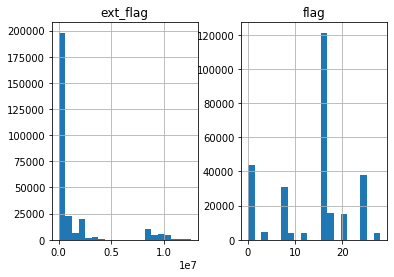


```python
game_data[game_data["label"]==1][complex_att_0x].hist(bins = 20)
```


    array([[<matplotlib.axes._subplots.AxesSubplot object at 0x000001B6AB236048>,
            <matplotlib.axes._subplots.AxesSubplot object at 0x000001B6AB261888>]],
          dtype=object)


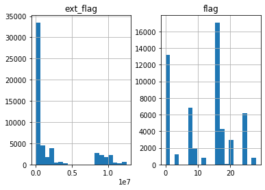


```python

```


```python

```


```python

```


```python

```
